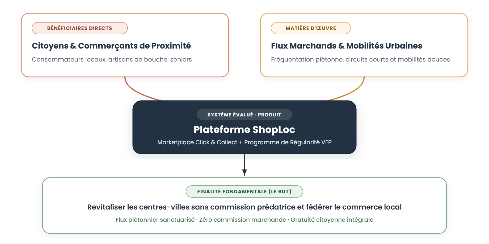
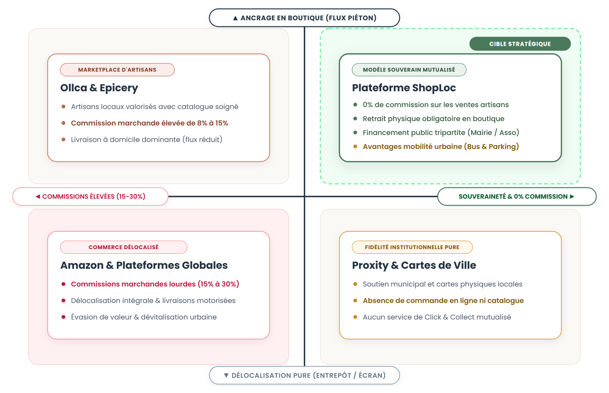
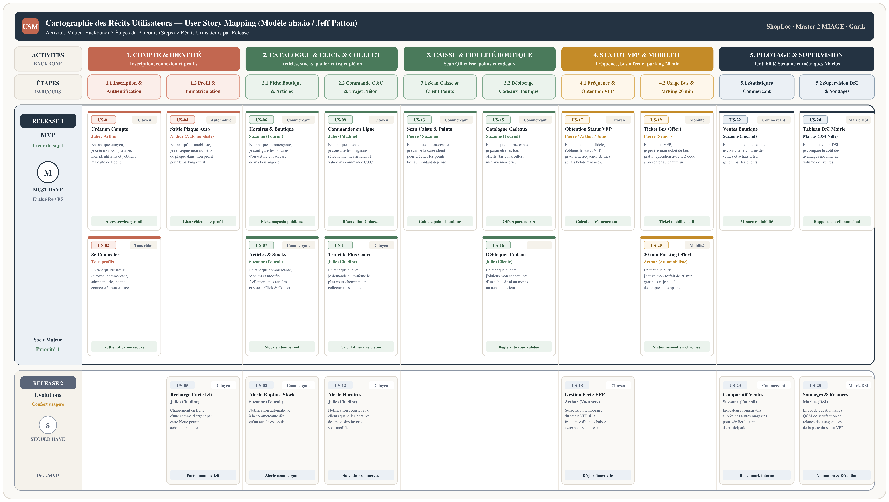
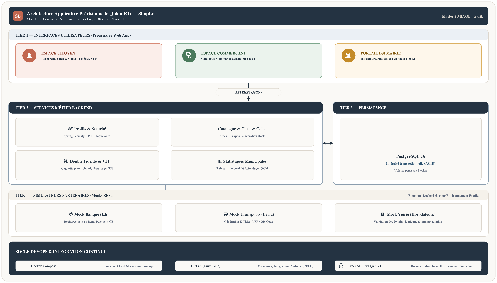
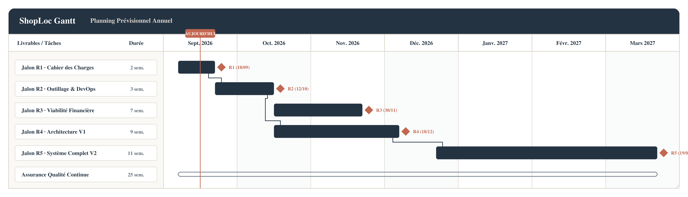

# 1. Présentation de l'entreprise Garik

## 1.1. Identité, vision et positionnement partenarial

L'entreprise **Garik** est une société d'ingénierie logicielle créée par un collectif de cinq étudiants en Master 2 MIAGE à l'Université de Lille. Notre formation nous apporte une double culture, technique et managériale, qui nous paraît particulièrement adaptée aux enjeux de la commande publique et du commerce connecté : d'un côté la maîtrise du génie logiciel, de l'architecture web et de l'intégration continue, et de l'autre la modélisation des processus métier, l'ingénierie des exigences et l'analyse stratégique des coûts.

Nous répondons aujourd'hui à l'appel d'offres émis pour la conception de la plateforme **ShopLoc**. Ce projet répond à une préoccupation majeure partagée par de nombreuses communes : la perte de vitalité des centres-villes face à l'attractivité des grandes zones commerciales de périphérie et des grandes plateformes internationales de commerce en ligne. Notre vision repose sur la mise à disposition d'un outil numérique souverain, accessible et éthique, conçu pour fédérer les commerçants de proximité et redonner envie aux habitants de consommer au cœur de leur quartier.

Pour garantir l'adhésion immédiate des artisans et commerçants indépendants, nous défendons un positionnement clair et vertueux :
- **Gratuité intégrale pour les usagers citoyens :** Aucun frais d'accès ni surcoût sur les produits n'est appliqué aux habitants, ce qui encourage une adoption rapide et régulière de la plateforme.
- **Zéro commission sur les ventes des commerçants :** Contrairement aux plateformes privées qui ponctionnent une part importante du chiffre d'affaires des commerces de proximité, ShopLoc n'applique aucun prélèvement sur les commandes, préservant ainsi intégralement leurs marges.
- **Financement communal mutualisé :** Le fonctionnement technique du service et la maintenance sont pris en charge par la collectivité locale sous la forme d'un abonnement forfaitaire annuel, au titre de sa politique de soutien au commerce local et d'incitation aux mobilités douces.

Notre équipe met à disposition de la maîtrise d'ouvrage une réelle complémentarité de compétences, présentée dans la section suivante, permettant de couvrir l'ensemble du cycle de vie du projet, du dialogue fonctionnel jusqu'au déploiement opérationnel.

# 2. Équipe projet et répartition des rôles

## 2.1. Présentation synthétique des compétences de l'équipe

L'équipe Garik réunit cinq étudiants dont les parcours académiques et les expériences professionnelles préalables (stages, alternances ou projets d'ingénierie) assurent une couverture équilibrée de tous les aspects du projet ShopLoc :

| Membre du groupe | Rôle principal dans le projet | Formation d'origine | Atouts majeurs et compétences clés |
|---|---|---|---|
| **Khalil Bouchama** | Responsable Qualité & Déploiement | Master 2 MIAGE, Licence MIAGE, DUT Informatique | Diagnostic et tests chez Alstom Crespin (analyse ferroviaire), développement web full-stack chez Benzz Auto (React, Strapi, PostgreSQL). Rigueur en validation et conteneurisation Docker. |
| **Abdelkader Heddi** | Responsable Communication & Relations MOA | Master 2 MIAGE (parcours IPI-NT), Licence MIAGE | Analyse fonctionnelle chez AG2R La Mondiale, animation des rituels d'équipe, rédaction des synthèses et formalisation des besoins. Gestion de projets web collaboratifs. |
| **Gautam Demeulemeester** | Responsable Architecture Back-Office & Données | Master 2 MIAGE, Licence MIAGE | Gestion de projet marketplace et refonte comptable chez Damart, logistique des flux chez Mondial Relay. Solides compétences en modélisation relationnelle SQL et intégrité des stocks. |
| **Rayane Alli** | Spécialiste Outils & Ingénieur Logiciel | Master 2 MIAGE, Licence MIAGE | Conception d'applications de gestion d'inventaire, automatisation des tests et chaînes de compilation. Réalisation des simulateurs légers (bouchons) pour les services partenaires. |
| **Ilyas Ait Ali** | Responsable Architecture Front-Office & Ergonomie | Master 2 MIAGE, Licence MIAGE, L1/L2 Recherche | Développement d'entreprise chez Sopra Steria, traitement d'incidents chez AG2R La Mondiale. Maîtrise des interfaces réactives et forte sensibilisation à l'accessibilité numérique. |

*(Note : Les curricula vitæ complets et détaillés de chaque membre de l'équipe sont joints en annexe du dossier).*

## 2.2. Répartition des rôles selon le cadre de l'UE GLOP

Afin de respecter fidèlement les six pôles de responsabilités définis dans le cadre pédagogique de l'UE Génie Logiciel par la Pratique, les responsabilités sont réparties entre les cinq membres du groupe de façon concrète et opérationnelle :

| Rôle officiel de l'UE | Titulaire désigné | Responsabilités concrètes au sein de l'équipe |
|---|---|---|
| **1. Responsable de la Qualité** | **Khalil Bouchama** | Veille à la cohérence et à la clarté des livrables écrits, organise les relectures de code croisées entre membres, et s'assure de la présence de tests automatisés pertinents avant toute intégration de nouvelle fonctionnalité. |
| **2. Responsable de la Communication** | **Abdelkader Heddi** | Rédige les comptes-rendus des séances de travail, maintient à jour le journal de bord de l'équipe, prépare les ordres du jour et assure la liaison officielle avec la maîtrise d'ouvrage (l'équipe enseignante). |
| **3. Responsable du Déploiement** | **Khalil Bouchama** | Administre le dépôt de code de l'équipe, rédige la notice d'installation pas à pas et configure les fichiers Docker Compose pour permettre aux enseignants de lancer la plateforme sans difficulté technique. |
| **4. Spécialiste Outils & Ingénieur Logiciel** | **Rayane Alli** | Met en place les environnements de travail communs, aide les membres du groupe sur les configurations d'outils et développe les simulateurs légers simulant les services de la banque, des transports et de la voirie. |
| **5. Responsable Architecture Back-Office** | **Gautam Demeulemeester** | Conçoit le schéma relationnel de la base de données, met en œuvre la logique de réservation des commandes en deux temps pour éviter les ruptures de stock, et implémente les services métier côté serveur. |
| **6. Responsable Architecture Front-Office** | **Ilyas Ait Ali** | Élabore les maquettes d'écrans, développe l'interface web responsive adaptée aux mobiles et aux ordinateurs, et veille à proposer une ergonomie intuitive accessible aux usagers les moins à l'aise avec le numérique. |

## 2.3. Organisation du travail et principe du Scrum Master tournant

Conformément à l'esprit d'un projet universitaire mené en autonomie, **notre équipe fonctionne selon une organisation collégiale et sans hiérarchie verticale**. Nous appliquons les principes de la méthode Agile Scrum en faisant tourner la responsabilité de l'animation d'équipe (**Scrum Master tournant**) à chaque jalon officiel fixé dans les diapositives du cours :

- **Jalon R1 (18/09/2026) — Cadrage & Réponse à l'appel d'offres :** Coordination par **Khalil Bouchama** (soutenance orale le 21/09/2026).
- **Jalon R2 (12/10/2026) — Choix d'outillage & Socle technique :** Coordination par **Rayane Alli** (évaluation sur dossier technique).
- **Jalon R3 (30/11/2026) — Analyse financière & Coûts complets :** Coordination par **Gautam Demeulemeester** (évaluation sur dossier financier).
- **Jalon R4 (18/12/2026) — Premier prototype logiciel & Architecture V1 :** Coordination par **Ilyas Ait Ali** (soutenance orale le 04/01/2027).
- **Jalon R5 (19/03/2027) — Version complète V2 & Bilan d'exploitation :** Coordination par **Abdelkader Heddi** (soutenance finale le 22/03/2027).

Au quotidien, notre travail s'organise autour d'une réunion hebdomadaire de synchronisation d'une trentaine de minutes permettant de faire le point sur les avancées, de partager les difficultés éventuelles et de redistribuer les tâches en cas de besoin, garantissant un investissement équitable de chacun.

# 3. Analyse fonctionnelle du sujet ShopLoc

## 3.1. Analyse du besoin et méthode APTE (Bête à cornes)

Pour appréhender objectivement la finalité de la plateforme ShopLoc, nous avons mis en œuvre la méthode d'analyse fonctionnelle du besoin APTE (norme AFNOR NF X 50-151) à travers l'outil de la « Bête à cornes » :

  
  
Figure 3.1 — Expression du besoin fondamental (Bête à cornes APTE — Norme AFNOR NF X 50-151)

Le système ShopLoc rend service à la fois aux **citoyens consommateurs**, aux **artisans et commerçants de proximité** et aux **collectivités territoriales**. Il agit directement sur **le dynamisme des cœurs de ville et les flux d'achats locaux**, dans le but de **revitaliser le commerce de proximité par des circuits courts, une visibilité numérique mutualisée et des avantages mobilité concrets**.

## 3.2. Identification des acteurs et benchmark concurrentiel

Le déploiement de ShopLoc articule quatre catégories d'acteurs clés :
- **Commerçants et artisans indépendants :** Recherche d'une visibilité en ligne sans rogner leurs marges ni alourdir le travail en boutique (0% de commission marchande).
- **Citoyens consommateurs (habitants et actifs) :** Volonté de consommer localement via un panier unique Click & Collect gratuit et des gratifications régulières.
- **Collectivité territoriale (Mairie / DSI) :** Volonté de redynamiser les cœurs de ville, d'inciter aux mobilités douces et de suivre des indicateurs anonymisés (RGPD).
- **Partenaires délégués :** Réseaux de transports urbains (titres de bus) et voirie municipale (contrôle du stationnement par plaque minéralogique).

### Benchmark comparatif et positionnement différenciant
Notre étude de marché classe l'existant en trois familles : (1) **Plateformes globales (Amazon, Deliveroo)** à fortes commissions (15-30%) et livraisons motorisées délocalisées ; (2) **Marketplaces privées de proximité (Ollca, Epicery)** à commissions marchandes (8-15%) centrées sur la livraison à domicile ; (3) **Cartes de fidélité de ville (Proxity)** sans catalogue en ligne ni panier mutualisé.

ShopLoc investit un positionnement public vertueux : **0% de commission marchande**, **gratuité citoyenne**, **Click & Collect pédestre mutualisé** et **double fidélité territoriale** (cagnotte boutique et statut VFP mobilité financé par la ville).

  
  
Figure 3.2 — Matrice de positionnement concurrentiel (Ancrage territorial vs. Équité du modèle économique)

## 3.3. Analyse des profils utilisateurs cibles (Personas)

L'étude des cas d'usage décrits dans le sujet d'appel d'offres permet d'identifier cinq profils types représentatifs des usagers et partenaires de la plateforme :
- **Pierre (74 ans) — Le senior fidèle de quartier :** Réalise quotidiennement sa tournée matinale chez les commerçants de proximité (Le Fournil, boucherie flamande, café des sports, tabac-presse). Même sans achat sur le web Click & Collect, la fréquence journalière de ses achats chez les partenaires lui permet d'obtenir rapidement le statut VFP et de débloquer la gratuité des transports en commun pour son trajet retour en bus.
- **Julie (31 ans) — La citadine active :** Consulte les horaires et commerces de son quartier sur le site web, commande ses articles en Click & Collect avec calcul du plus court chemin pour collecter ses achats, recharge sa carte en ligne par carte bleue (type Izli) et dépense ses points fidélité en avantages boutique (avec obligation d'achat antérieur et présentation de carte lors du paiement en cours).
- **Arthur (34 ans) — Le père de famille automobiliste :** Fréquente la boulangerie sur le chemin de l'école de son fils. Il s'abonne au service, renseigne sa plaque d'immatriculation dans son profil et active ses 20 minutes de stationnement offertes grâce au statut VFP pour effectuer ses courses en centre-ville.
- **Suzanne (22 ans) — La commerçante (Boulangerie Le Fournil) :** Met à jour son catalogue Click & Collect et ses stocks disponibles, paramètre les lots offerts dans le catalogue fidélité (tarte au maroilles, viennoiserie), scanne les cartes en caisse et consulte les statistiques de ventes associées au programme pour mesurer la rentabilité de sa participation.
- **Marius (27 ans) — Le gestionnaire municipal à la DSI :** Supervise le tableau de bord comparant le coût des avantages mobilité (partenariat Ilévia et parkings) au volume de vente généré, relance les usagers lors de la perte du statut VFP et diffuse des offres promotionnelles ou des sondages de satisfaction (QCM).

*(Note : Les fiches complètes et détaillées de ces personas, conçues lors de l'étude de cadrage ergonomique, sont jointes en annexe du dossier au format A4 paysage).*

## 3.4. Cartographie des récits utilisateurs (User Story Mapping)

Conformément à la méthode officielle de **User Story Mapping** ([guide de référence aha.io / Jeff Patton](https://www.aha.io/roadmapping/guide/release-management/what-is-user-story-mapping)), l'ensemble des exigences du projet est structuré selon une hiérarchie à trois niveaux :
1. **Activités utilisateurs (Backbone / User Activities) :** Les 5 grands thèmes structurant l'expérience : *1. Compte & Profils*, *2. Catalogue & Click & Collect*, *3. Caisse & Fidélité Boutique*, *4. Statut VFP & Mobilité*, *5. Pilotage & Supervision*.
2. **Étapes séquentielles du parcours (User Steps) :** Les étapes concrètes réalisées de gauche à droite sous chaque activité (ex. Inscription & Connexion, Profil & Plaque, Gestion Boutique & Articles, Commande & Trajet, Scan & Points, Lots & Cadeaux, Fréquence & VFP, Mobilité, Statistiques et Supervision).
3. **Découpage par Release (Tranches horizontales) :**
   - **Release 1 (MVP) :** Cœur contractuel obligatoire pour les jalons R4/R5 (création de compte, connexion sécurisée, consultation et gestion de fiche boutique, catalogue d'articles et gestion des stocks, commande Click & Collect, calcul du plus court chemin pédestre, scan en caisse, cumul de points boutique, conversion en lots/cadeaux, attribution du statut VFP, génération de ticket de bus dématérialisé, activation de 20 minutes de parking offert, tableaux de bord des ventes commerçant et supervision municipale DSI).
   - **Release 2 (Évolutions & Confort) :** Fonctionnalités complémentaires prévues pour enrichir l'expérience (recharge de carte en ligne type Izli, alertes automatiques de modification d'horaires et de seuil de stock pour le commerçant, suspension temporaire du statut VFP pendant les vacances scolaires, comparatif de rentabilité pour les commerçants, sondages municipaux courts par QCM et relances automatisées de la DSI).

  
  
Figure 3.3 — Grille de User Story Mapping (Modèle aha.io : Activités &gt; Étapes &gt; Récits par Release)

## 3.5. Découpage modulaire du système

L'ensemble des exigences métier est structuré en quatre modules opérationnels :

- **Module A — Gestion des acteurs & conventionnement :**
  - *Adhésion commerçante conventionnée :* Compte professionnel unique par boutique, sous validation préalable de la collectivité.
  - *Fiches d'établissement & horaires :* Paramétrage des créneaux réguliers et alertes courriel automatiques aux clients favoris en cas de modification ponctuelle.

- **Module B — Marketplace locale & Click & Collect mutualisé :**
  - *Catalogue & synchronisation des stocks :* Réservation en deux temps évitant les ruptures avec les ventes physiques en boutique.
  - *Panier d'achat multi-boutiques & parcours piéton :* Commande groupée multi-commerçants et calcul de l'itinéraire de retrait pédestre le plus rapide.
  - *Délais de préparation & exclusion de livraison :* Respect des temps de confection artisanale ; livraison motorisée expressément exclue pour favoriser la marche en centre-ville.

- **Module C — Double système de fidélité & statut VFP :**
  - *Fidélité commerçante privée :* Cagnottage de points boutique convertibles en réductions ou cadeaux (avec règle anti-abus au passage en caisse).
  - *Fidélité territoriale citoyenne (statut VFP) :* 10 passages sur 15 jours glissants conférant un titre de transport ou 20 min de stationnement offert par la ville.
  - *Supports universels :* Carte physique plastifiée avec QR code pour les personnes non connectées, application web mobile et porte-monnaie d'appoint (type Izli).

- **Module D — Portail de supervision municipale & animation :**
  - *Tableau de bord de suivi économique :* Indicateurs d'activité en centre-ville, fréquentation par quartier et budget mobilité consommé.
  - *Animation locale & sondages (QCM) :* Diffusion de questionnaires courts de satisfaction et communication d'événements municipaux.
  - *Gestion des no-shows & conformité RGPD :* Remise en vente automatique des commandes non retirées, anonymisation stricte et aucun traçage de géolocalisation.

# 4. Premiers choix justifiés d'outils logiciels

## 4.1. Architecture logicielle prévisionnelle et cadre méthodologique

Pour répondre avec réalisme aux exigences du projet, nous avons retenu une architecture applicative 3-tiers modulaire reposant sur des composants clairement isolés. Il s'agit d'une **proposition préliminaire de cadrage pour le jalon R1**, qui sera éprouvée par notre équipe et formellement validée lors du jalon R2 :

  
  
Figure 4.1 — Schéma d'architecture applicative préliminaire et choix techniques prévisionnels

Cette architecture s'articule autour de quatre niveaux opérationnels cohérents :
1. **Tier Clients & Interfaces Web (React + TypeScript) :** Une application web responsive (PWA) offrant des interfaces dédiées pour les citoyens consommateurs, les commerçants artisans et les gestionnaires municipaux de la mairie.
2. **Tier Backend & Services Métier (Java Spring Boot 3) :** Un serveur d'application modulaire articulé en services métier spécialisés (*Gestion des Profils*, *Catalogue & Réservation Click & Collect*, *Moteur de Fidélité & VFP*, *Tableau de bord municipal*), communiquant via des interfaces REST normalisées.
3. **Tier Persistance & Données (PostgreSQL 16) :** Une base relationnelle assurant l'intégrité transactionnelle stricte (ACID) des commandes et des mouvements de points, persistée sur volume de données dédié.
4. **Tier Simulateurs Partenaires (Mocks REST) :** Des bouchons applicatifs légers simulant les échanges avec les services tiers (rechargement bancaire type Izli, titres de transport Ilévia, contrôle de stationnement municipal) pour garantir l'autonomie totale des tests en environnement étudiant.

L'ensemble de ces briques est orchestré par **Docker Compose** et versionné sur la forge institutionnelle **GitLab de l'Université de Lille**, garantissant un déploiement reproductible en une commande unique (`docker compose up`).

## 4.2. Choix de la pile technologique (Backend, Frontend, Données)

Les choix techniques présentés ci-dessous ont été guidés par trois impératifs : la robustesse industrielle, la pertinence par rapport aux enseignements du Master MIAGE, et la simplicité de prise en main collective pour notre groupe de cinq étudiants :

- **Backend applicatif : Java (Spring Boot / J2E) avec Maven**
  - *Justification :* Java Spring Boot répond aux directives du sujet pour la mise en place d'une architecture orientée composants d'entreprise. Il assure une gestion transactionnelle robuste indispensable au protocole de réservation des stocks et à la cohérence de la fidélité, ainsi qu'une sécurité éprouvée (Spring Security pour les accès commerçants et municipaux). Maven garantit la reproductibilité des builds. Cette orientation préliminaire sera confrontée à une solution alternative légère lors des expérimentations du jalon R2.
- **Frontend utilisateur et commerçant : React avec TypeScript et Tailwind CSS**
  - *Justification :* React permet de construire des interfaces découpées en composants réutilisables, ce qui facilite la mise au point conjointe des écrans citoyens et commerçants. Conçu sous forme d'application web réactive (Progressive Web App), le service est directement utilisable depuis un navigateur mobile sans imposer aux usagers de télécharger une application dédiée sur les magasins d'applications.
- **Base de données relationnelle : PostgreSQL (version 16)**
  - *Justification :* Les transactions commerciales, les mouvements de stocks et les règles de fidélité nécessitent une intégrité relationnelle absolue (propriétés ACID). PostgreSQL constitue une référence éprouvée pour ce type d'usage, assurant une parfaite étanchéité des données et une gestion robuste des index.

## 4.3. Outillage collaboratif, intégration continue et simulateurs

- **Gestion de versions et forge logicielle : GitLab (Université de Lille)**
  - *Justification :* La forge institutionnelle de l'université centralise notre code source et garantit une visibilité totale de l'historique de nos travaux pour l'équipe pédagogique. Nous adoptons une gestion de branches simple et lisible avec une branche principale stable (`main`), une branche de développement (`develop`) et des branches de fonctionnalités isolées.
- **Contrat d'interface formalisé : Spécification OpenAPI 3.1 (Swagger)**
  - *Justification :* Pour assurer une collaboration fluide entre l'architecture back-end (Gautam Demeulemeester) et l'architecture front-end (Ilyas Ait Ali), l'ensemble des points d'entrée d'API fera l'objet d'une documentation OpenAPI claire. Cela évite les malentendus techniques et permet de paralléliser les développements en toute confiance.
- **Conteneurisation et exécution : Docker & Docker Compose**
  - *Justification :* Docker permet d'encapsuler chaque composant (backend, frontend, base PostgreSQL et simulateurs) dans des environnements isolés et reproductibles. Ce choix garantit que le projet pourra être démarré sur les ordinateurs des évaluateurs à l'aide d'une simple commande `docker compose up`, sans risque de conflits de versions logicielles.
- **Simulateurs de services partenaires (Mocks REST) :**
  - *Justification :* Ne pouvant pas nous connecter en direct aux infrastructures privées des banques (rechargement Izli), des réseaux de transport en commun (Ilévia) ou des serveurs de stationnement municipaux, ces briques seront simulées par des bouchons applicatifs légers intégrés dans l'environnement Docker, permettant de tester l'ensemble des parcours utilisateurs en parfaite autonomie.

# 5. Diagramme de Gantt annuel prévisionnel

## 5.1. Calendrier des jalons contractuels officiels

Le calendrier de développement de ShopLoc est structuré sur sept mois, de septembre 2026 à mars 2027, en s'alignant rigoureusement sur les cinq jalons d'évaluation définis par la maîtrise d'ouvrage dans le cadre de l'UE GLOP :

| Jalon contractuel | Date de remise | Format de restitution | Livrables et objectifs attendus |
|---|---|---|---|
| **R1 — Cadrage & Appel d'offres** | 18 septembre 2026 (18h) | Dossier PDF & Soutenance le 21/09 (Amphi Turing) | Présentation de l'entreprise, CVs de l'équipe, analyse des besoins, premiers choix d'outils, Gantt et étude des coûts. |
| **R2 — Outillage & DevOps** | 12 octobre 2026 | Dossier technique évalué sur pièces | Sélection et justification approfondie des outils, configuration du dépôt Git, conteneurs Docker et simulateurs partenaires. |
| **R3 — Viabilité financière** | 30 novembre 2026 | Dossier financier évalué sur pièces | Étude économique complète basée sur la méthode des coûts complets, seuil de rentabilité et pérennité du modèle. |
| **R4 — Architecture V1 & Prototype** | 18 décembre 2026 (18h) | Dossier d'architecture, code & Soutenance le 04/01/2027 | Documentation d'architecture logicielle et premier démonstrateur opérationnel sous Docker (catalogue et réservation Click & Collect). |
| **R5 — Version complète V2** | 19 mars 2027 (18h) | Système complet & Soutenance le 22/03/2027 | Version finale intégrant la fidélité VFP, le portail municipal, les tests d'intégration complets et le bilan d'exploitation. |

## 5.2. Diagramme de Gantt prévisionnel sur l'année

Le diagramme ci-après retrace le cheminement chronologique des activités, en tenant compte des périodes universitaires d'examens et de congés afin de sécuriser nos livraisons :

  
  
Figure 5.1 — Diagramme de Gantt annuel prévisionnel du projet ShopLoc (Jalons officiels R1 à R5 — 2026-2027)

Le projet s'organise autour de cinq phases de travail coordonnées :
- **Phase 1 (Septembre - Mi-octobre 2026) :** Réponse à l'appel d'offres, formalisation des exigences fonctionnelles et mise en place de la chaîne d'outils partagée (Jalons R1 et R2).
- **Phase 2 (Mi-octobre - Fin novembre 2026) :** Élaboration de l'étude financière par la méthode des coûts complets et conception préliminaire des schémas de données (Jalon R3).
- **Phase 3 (Décembre 2026 - Début janvier 2027) :** Développement du socle applicatif et du prototype fonctionnel Click & Collect mutualisé sous Docker (Jalon R4).
- **Phase 4 (Janvier - Mi-mars 2027) :** Implémentation du moteur de double fidélité, de l'espace de supervision municipal, des simulateurs de services et des tests de non-régression (Jalon R5).
- **Phase 5 (Fin mars 2027) :** Recette d'ensemble, rédaction de la documentation finale et soutenance de clôture du projet.

## 5.3. Dispositif de sécurisation des délais et gestion des risques

Pour prévenir les retards et assurer la régularité du travail en équipe, notre groupe met en œuvre trois mesures simples et pragmatiques :
- **Estimation réaliste de la charge étudiante :** L'investissement de chaque étudiant est calibré à environ 6 à 8 heures de travail effectif par semaine sur les 25 semaines actives de l'année universitaire, ce qui représente un volume collectif d'environ 900 à 1 000 heures de travail sur l'ensemble du cycle de vie du projet.
- **Règle du gel des modifications (Buffer de 72 heures) :** Avant chaque échéance de remise contractuelle, un arrêt des ajouts fonctionnels est programmé 72 heures à l'avance. Cette période est exclusivement réservée à la relecture collective des documents, aux tests d'installation sur des ordinateurs témoins et à la répétition minutieuse des présentations orales (15 minutes de présentation suivies de 5 minutes de questions).
- **Point hebdomadaire d'alerte :** Lors de notre réunion hebdomadaire animée par Abdelkader Heddi, tout retard sur une tâche assignée est identifié immédiatement afin de réajuster la répartition du travail ou d'organiser un binôme d'entraide temporaire.

# 6. Étude financière et méthode des coûts complets

Le modèle économique d'un système d'information territorial comme ShopLoc doit être calculé de façon rigoureuse et transparente. Conformément aux consignes de l'appel d'offres et aux méthodes enseignées dans le cours de gestion financière (*La gestion stratégique des coûts*), notre chiffrage applique la **méthode des coûts complets** pour déterminer le coût de revient réel de la solution développée par notre start-up étudiante Garik, et justifier le montant de l'abonnement annuel proposé aux collectivités partenaires.

## 6.1. Identification et sourçage des charges du projet

L'évaluation financière repose sur des charges réelles et documentées, découpées entre les charges directes de personnel et les charges indirectes de fonctionnement :

### Charges directes de personnel (Réalisation logicielle)
La phase de conception et de développement mobilise les 5 étudiants associés de Garik sur les 6 mois actifs du projet (septembre 2026 à février 2027 inclus). Conformément à notre statut d'étudiants-ingénieurs en Master 2, nous valorisons ce travail sur la base réaliste d'une indemnité mensuelle de gratification de stage ou d'alternance fixée à **800,00 € par étudiant et par mois**, soit :
$$\text{Charge directe mensuelle de l'équipe} = 5 \times 800{,}00\text{ €} = 4\,000{,}00\text{ € / mois}$$
$$\text{Charge directe totale de réalisation (6 mois)} = 6 \times 4\,000{,}00\text{ €} = \mathbf{24\,000{,}00\text{ €}}$$

### Charges indirectes et frais externes sourcés
Les charges indirectes correspondent aux dépenses d'infrastructure technique, de communication et de fonctionnement nécessaires à l'exploitation du service :
- **Hébergement Cloud VPS dédié (OVHcloud, offre Comfort) :** Serveur sécurisé sous Linux (4 cœurs vCPU, 8 Go de mémoire vive, stockage 100 Go NVMe, bande passante 1 Gbps et sauvegardes quotidiennes automatisées) permettant d'isoler les conteneurs Docker de la collectivité : **35,00 € HT / mois**, soit **420,00 € HT / an**.
- **Nom de domaine territorial (OVHcloud) :** Réservation d'un nom de domaine institutionnel en `.fr` avec protection DNSSEC et gestion de la zone DNS : **10,00 € HT / an**.
- **Certificats de sécurité SSL/TLS (Let's Encrypt) :** Génération et renouvellement automatisé des certificats HTTPS de chiffrement : **0,00 €** (solution open-source).
- **Service d'envoi de courriels transactionnels (Brevo, ex-Sendinblue, plan Starter) :** Envoi des notifications de commande, alertes de rupture de stock aux commerçants et réinitialisation de mots de passe : **19,00 € HT / mois**, soit **228,00 € HT / an**.
- **Assurance Responsabilité Civile Professionnelle (RC Pro start-up junior) :** Couverture des risques d'exploitation et de responsabilité numérique : **350,00 € HT / an**.
- **Frais généraux d'outillage et amortissement matériel :** Amortissement partiel des postes de travail des cinq étudiants et licences bureautiques : **500,00 € HT / an**.

Le montant global des charges indirectes s'élève donc à :
$$\text{Total des charges indirectes annuelles} = 420 + 10 + 0 + 228 + 350 + 500 = \mathbf{1\,508{,}00\text{ € HT / an}}$$

La masse totale des charges à répartir s'établit ainsi à :
$$\text{Masse totale des charges annuelles} = 24\,000{,}00 + 1\,508{,}00 = \mathbf{25\,508{,}00\text{ € HT}}$$

## 6.2. Découpage en centres d'analyse auxiliaires et principaux

Conformément à la méthode des coûts complets, l'activité de l'entreprise Garik est structurée en cinq centres d'analyse distincts :
1. **Centres auxiliaires (Centres de support interne) :**
   - **Administration & Direction de projet :** Pilotage global, gestion administrative, conventions et réunions d'équipe (4 500,00 € de charges réparties).
   - **Support Infrastructure & Outils :** Hébergement technique, administration des serveurs et maintenance de la forge logicielle (2 008,00 € comprenant les 1 508,00 € de frais externes et 500,00 € de travail technique interne).
2. **Centres principaux (Centres opérationnels) :**
   - **Vente & Relations Collectivités :** Prospection des municipalités, contractualisation tripartite et accompagnement institutionnel.
   - **Réalisation & Développement Logiciel :** Conception technique, développement frontend/backend, intégration des bases de données et tests.
   - **Maintenance & Support Utilisateurs :** Résolution d'anomalies, assistance technique auprès des commerçants et maintien en condition opérationnelle.

## 6.3. Tableau de répartition primaire et secondaire des charges

La répartition primaire affecte l'ensemble des charges directes et indirectes dans les cinq centres. La répartition secondaire déverse ensuite les coûts des centres auxiliaires vers les centres principaux selon des clés de répartition proportionnelles à l'activité :

- **Clé de déversement du centre Administration :** 20% vers le centre Vente, 50% vers le centre Réalisation, et 30% vers le centre Maintenance.
- **Clé de déversement du centre Support Infrastructure :** 10% vers le centre Vente, 60% vers le centre Réalisation, et 30% vers le centre Maintenance.

Le tableau ci-dessous détaille les calculs de répartition :

| Intitulé des centres d'analyse | Charges directes de personnel | Charges indirectes externes | Total Répartition Primaire | Déversement Administration | Déversement Infrastructure | Coût Total Après Répartition Secondaire |
|---|---|---|---|---|---|---|
| **Administration (Auxiliaire)** | 4 000,00 € | 500,00 € | 4 500,00 € | -4 500,00 € | — | **0,00 €** |
| **Infrastructure (Auxiliaire)** | 1 000,00 € | 1 008,00 € | 2 008,00 € | — | -2 008,00 € | **0,00 €** |
| **Vente & Collectivités (Principal)** | 3 000,00 € | — | 3 000,00 € | +900,00 € (20%) | +200,80 € (10%) | **4 100,80 €** |
| **Réalisation & Dev (Principal)** | 14 000,00 € | — | 14 000,00 € | +2 250,00 € (50%) | +1 204,80 € (60%) | **17 454,80 €** |
| **Maintenance & Support (Principal)** | 2 000,00 € | — | 2 000,00 € | +1 350,00 € (30%) | +602,40 € (30%) | **3 952,40 €** |
| **Total Général** | **24 000,00 €** | **1 508,00 €** | **25 508,00 €** | **0,00 €** | **0,00 €** | **25 508,00 €** |

## 6.4. Définition des unités d'œuvre et calcul des coûts unitaires

Pour chaque centre principal, nous définissons une Unité d'Œuvre (UO) représentative de son volume d'activité sur la première année d'exploitation de la plateforme :

| Centre d'analyse principal | Nature de l'Unité d'Œuvre (UO) | Volume prévisionnel d'UO (Année 1) | Formule de calcul du coût unitaire | Coût complet unitaire de l'UO |
|---|---|---|---|---|
| **Vente & Relations Collectivités** | Commune conventionnée déployée | 3 communes partenaires | 4 100,80 € / 3 communes | **1 366,93 € HT / commune** |
| **Réalisation & Développement** | Heure d'ingénierie logicielle | 800 heures de développement | 17 454,80 € / 800 heures | **21,82 € HT / heure de dev** |
| **Maintenance & Support** | Commerçant adhérent accompagné | 60 commerçants actifs | 3 952,40 € / 60 commerçants | **65,87 € HT / commerçant / an** |

Ces coûts unitaires reflètent fidèlement la réalité économique de notre structure : le coût d'une heure d'ingénierie logicielle (21,82 € HT) demeure modéré grâce à notre statut universitaire, tout en valorisant convenablement le travail accompli.

## 6.5. Déduction et justification du modèle économique SaaS

La méthode des coûts complets permet de calculer le coût de revient exact du déploiement de ShopLoc dans une commune moyenne (comptant environ 20 commerces partenaires la première année) :
- **Quote-part du centre Vente & Collectivités :** 1 366,93 € HT (frais d'adhésion et mise en place de la convention).
- **Amortissement de la réalisation logicielle :** La réalisation logicielle initiale (17 454,80 € HT) est conçue comme un investissement réutilisable amorti sur 3 ans et mutualisé entre 3 communes pilotes, soit une charge annuelle de :
$$\text{Quote-part annuelle de développement} = \frac{17\,454{,}80\text{ €}}{3\text{ ans} \times 3\text{ communes}} \approx \mathbf{1\,939{,}42\text{ € HT / commune / an}}$$
- **Quote-part de maintenance pour 20 commerçants :** $20 \times 65{,}87\text{ €} = \mathbf{1\,317{,}40\text{ € HT / an}}$.
- **Hébergement Cloud VPS dédié et nom de domaine communal :** $420 + 10 = \mathbf{430{,}00\text{ € HT / an}}$.

En additionnant ces composantes récurrentes à l'issue de la première phase de démarrage, le coût de revient annuel complet d'une collectivité s'établit à :
$$\text{Coût de revient complet annuel pour une commune} \approx 1\,939{,}42 + 1\,317{,}40 + 430{,}00 = \mathbf{3\,686{,}82\text{ € HT / an}}$$

### Tarification proposée et équité territoriale
Ce calcul objectif justifie pleinement la tarification forfaitaire que l'entreprise Garik soumet à la maîtrise d'ouvrage :
- **Abonnement annuel forfaitaire pour la collectivité :** **3 900,00 € HT / an** (soit seulement **325,00 € HT par mois** pour l'ensemble de la commune).
- Ce montant couvre l'intégralité des coûts d'exploitation et de maintenance, amortit le développement initial et dégage une marge de sécurité de gestion d'environ 5% (213,18 €/an) permettant de faire face aux imprévus techniques.
- Pour la municipalité, cet investissement reste modeste au regard de son budget global de développement économique, tout en garantissant un dispositif **entièrement gratuit pour les usagers** et **sans aucune commission prélevée sur les artisans et commerçants**.

