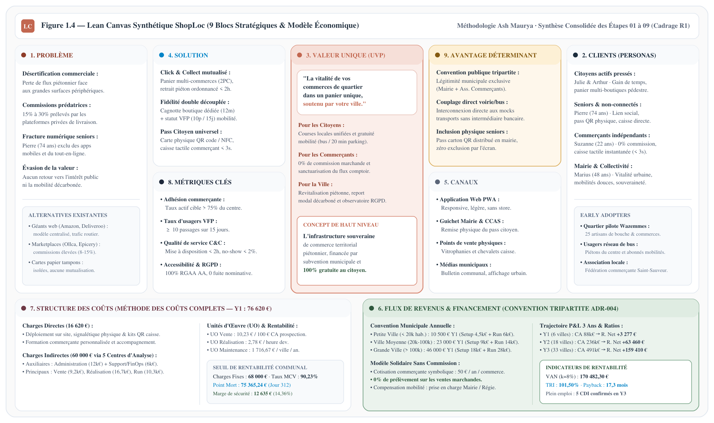

## 1.1. Présentation du Projet & Double Finalité

ShopLoc est une plateforme numérique territoriale conçue pour redynamiser le commerce de centre-ville en associant commerçants indépendants, citoyens et collectivités. Face aux plateformes dématérialisées, le projet repose sur un principe cardinal : **le numérique doit impérativement conduire l'usager physiquement en boutique** via le Click & Collect piétonnier obligatoire.

Le système répond à une **double finalité** indissociable :
* **Finalité Commerciale (Commerçants & Artisans)** : Vitrine mutualisée sans commission sur les ventes (0% marchand) et programme de fidélité dédié propre à chaque établissement.
* **Finalité Citoyenne (Collectivité & Usagers)** : Outil public stimulant la fréquentation piétonne et les mobilités douces via le statut Very Faithful Person (VFP), récompensant la régularité des passages.

---

## 1.2. Expression du Besoin (Bête à Cornes)

La démarche fonctionnelle caractérise la raison d'être du système à travers ses trois dimensions canoniques :
* **Bénéficiaires directs (À qui rend-il service ?)** : Commerçants et artisans (vente sans commission), citoyens (accès local unifié) et collectivités (vitalité urbaine).
* **Matière d'œuvre (Sur quoi agit-il ?)** : Flux de fréquentation piétonne, circuits courts et mobilités actives du quotidien.
* **Finalité fondamentale (Dans quel but ?)** : Revitaliser durablement le commerce local sans modèle prédateur tout en valorisant la régularité citoyenne.

Figure 1.1 — Expression du Besoin (Bête à Cornes)

## 1.3. Matrice de Positionnement Stratégique & Concurrentiel

Pour situer ShopLoc dans son écosystème, le projet est positionné sur deux axes directeurs :
* **Axe horizontal (Modèle économique & souveraineté)** : Oppose les plateformes privées à fortes commissions (15% à 30%) à un modèle vertueux financé par subvention tripartite garantissant 0% de prélèvement marchand et la gratuité citoyenne.
* **Axe vertical (Ancrage logistique & spatial)** : Oppose la délocalisation logistique en entrepôts avec livraisons motorisées au retrait physique obligatoire en boutique (Click & Collect pédestre).

Figure 1.2 — Matrice de Positionnement Stratégique & Concurrentiel

**Légende analytique & Benchmark des solutions étudiées**

Afin d'asseoir le positionnement de ShopLoc, un benchmark comparatif des dispositifs existants sur le marché a été réalisé :
* **Marketplaces de proximité (Ollca, Epicery)** : Bien qu'elles valorisent les artisans locaux, notre étude comparative souligne qu'elles appliquent une commission marchande de 8% à 15% et privilégient la livraison à domicile, ce qui ne dynamise pas le flux physique en boutique.
* **Plateformes globales & livraison rapide (Amazon, Deliveroo)** : Modèles centralisés à fortes commissions (15% à 30%) reposant sur des livraisons motorisées qui accélèrent l'évasion de valeur hors des centres-villes.
* **Dispositifs de fidélité de ville (Proxity, cartes commerçantes)** : Renforcent la fidélité locale mais se limitent à des cartes physiques en caisse, sans catalogue en ligne ni panier unifié Click & Collect.
* **Plateforme ShopLoc (Positionnement cible)** : Répond aux manques identifiés par le benchmark en combinant une vitrine numérique mutualisée, un modèle à 0% de commission marchande et une incitation aux mobilités douces conditionnée au passage physique.

## 1.4. Synthèse Panoramique du Modèle : Le Lean Canvas ShopLoc

Conformément à la démarche d'ingénierie par arborescence inversée établie dans le plan directeur, le **Lean Canvas** constitue la clé de voûte stratégique du projet ShopLoc. Développé selon la méthodologie canonique d'Ash Maurya, il consolide en 9 blocs interconnectés l'intégralité des dimensions opérationnelles, techniques et financières modélisées dans le présent cahier des charges.

Figure 1.4 — Lean Canvas Synthétique ShopLoc (9 Blocs Stratégiques &amp; Modèle Économique)

**Articulation Systémique des 9 Blocs Stratégiques**

1. **Couplage Problème / Solution** : Le diagnostic initial de désertification commerciale et de prédation des plateformes privées (15% à 30% de commission) trouve sa résolution directe dans une marketplace Click &amp; Collect mutualisée à 0% de prélèvement marchand, complétée par un double moteur de fidélité découplé (cagnotte commerçante locale vs mobilité urbaine VFP 10 passages sur 15 jours).
2. **Couplage Personas / Proposition de Valeur Unique** : Les quatre personas cibles (Pierre le senior, Suzanne l'artisane commerçante, Julie &amp; Arthur les actifs pressés, Marius la collectivité territoriale) bénéficient d'une proposition de valeur différenciée mais unifiée : réancrer les achats en boutique par le passage physique en centre-ville.
3. **Piliers de Viabilité Économique &amp; Coûts Complets** : La convention tripartite municipale (ADR-004) et la structure des coûts complets garantissent un seuil de rentabilité communal maîtrisé (75 365,24 € au 312ᵉ jour) et un modèle autofinancé pérenne sans dépendance aux financements spéculatifs.

## 1.5. Objectifs du Projet

Les objectifs du projet se structurent en orientations stratégiques de politique publique et en objectifs opérationnels déclinés selon les finalités propres à chaque profil d'acteur.

### 1. Objectifs Stratégiques (Politique Publique & Vitalité Urbaine)

* **OS-01 : Revitalisation durable du commerce de centre-ville**
  *Énoncé :* Réorienter durablement les flux d'achats locaux vers les commerces indépendants de quartier.
  *Explication :* Fédérer l'offre sur une vitrine mutualisée à 0% de commission, en exigeant systématiquement le retrait des commandes en boutique.
* **OS-02 : Décarbonation des mobilités du quotidien**
  *Énoncé :* Convertir les déplacements marchands en mobilités piétonnes, cyclables et collectives.
  *Explication :* Inciter aux mobilités douces via le statut VFP, récompensant la régularité des visites physiques par des titres de transport et du stationnement.
* **OS-03 : Souveraineté territoriale et cohésion sociale**
  *Énoncé :* Fournir à la collectivité un outil d'intérêt général partagé, pérenne et inclusif.
  *Explication :* Financement tripartite sans modèle prédateur, gratuité citoyenne totale, inclusion des seniors (carte papier QR) et conformité RGPD.

### 2. Objectifs Opérationnels par Profil d'Acteur (Format Analyste)

#### Catégorie Citoyen & Consommateur — Achat local sans frais et valorisation des trajets
* **OP-CIT-01 : Commande Click & Collect groupée et retrait pédestre**
  *Énoncé :* Permettre la constitution d'un panier multi-commerces en un règlement unique avec retrait ordonnancé.
  *Explication :* Réservation des stocks en temps réel (Two-Phase Commit) supprimant toute rupture au comptoir et itinéraire piéton optimisé (< 2h).
* **OP-CIT-02 : Enregistrement de fidélité express et attribution VFP**
  *Énoncé :* Valider le passage physique en caisse en moins de trois secondes, sur smartphone comme sur carte papier.
  *Explication :* Scan du QR code personnel (adapté aux seniors), incrémentation du solde boutique et octroi d'un titre de transport dès 10 passages sur 15 jours.

#### Catégorie Commerçant & Artisan — Vente physique directe et préservation de la marge
* **OP-COM-01 : Pilotage autonome du catalogue et des stocks sans commission**
  *Énoncé :* Administrer ses produits et stocks en moins de trois clics sur tout terminal existant sans frais d'intermédiation.
  *Explication :* Interface allégée garantissant 0% de prélèvement sur les ventes et sanctuarisant la relation client directe au comptoir.
* **OP-COM-02 : Animation d'un programme de fidélité exclusif**
  *Énoncé :* Fidéliser sa clientèle régulière au moyen de gratifications cantonnées au point de vente.
  *Explication :* Gestion d'un solde de points propre à l'enseigne (validité 12 mois), sans fongibilité ni transfert vers des commerces concurrents.

#### Catégorie Collectivité Locale — Mobilités durables, vitalité urbaine et décision publique
* **OP-COL-01 : Délivrance automatisée des gratifications de mobilité**
  *Énoncé :* Émettre sans friction les titres de transport et crédits de stationnement dès franchissement du seuil VFP.
  *Explication :* Connexion automatique par APIs/mocks avec le réseau de bus municipal et les gestionnaires de voirie locale.
* **OP-COL-02 : Observatoire économique territorial anonymisé**
  *Énoncé :* Restituer aux décideurs publics des indicateurs consolidés d'activité et de flux piétons.
  *Explication :* Tableaux de bord de fréquentation urbaine sans traçage individuel ni croisement de données nominatives (RGPD).

## 1.6. Périmètre du Système : Ce qui est Inclus et Exclu

Afin de garantir la faisabilité opérationnelle et de respecter les engagements d'éco-conception, les frontières du système sont délimitées :

| Périmètre Inclus (In-Scope) | Périmètre Exclu (Out-of-Scope) |
|---|---|
| **Retrait physique exclusif en boutique** : Click & Collect pédestre obligatoire pour toute commande. | **Livraison à domicile formellement exclue** : Aucune flotte de coursiers ni logistique motorisée. |
| **Fidélité marchande dédiée** : Points propres à chaque commerce, cumulables et utilisables uniquement dans la boutique émettrice (validité 12 mois). | **Aucun pont de fidélité marchand inter-boutiques** : Les points acquis chez un commerçant ne sont pas transférables chez un confrère. |
| **Statut territorial VFP** : Débloqué après 10 passages physiques sur 15 jours glissants (1 ticket de bus ou 20 minutes de stationnement offertes). | **Aucune fongibilité inter-villes** : Les avantages acquis dans une commune ne sont pas utilisables dans une autre. |
| **Panier multi-commerces** : Validation et paiement groupé avec ventilation comptable automatisée. | **Aucun équipement dédié pour les agents de voirie (ASVP)** : Contrôle du stationnement via leurs terminaux existants par API légère. |
| **Inclusion universelle par carte physique** : Carte papier ou PVC munie d'un QR code pour les usagers non connectés (seniors). | **Aucune activité bancaire** : La plateforme n'assure aucun service de crédit ou d'avance de trésorerie. |
| **Simulateurs de services externes (Mocks)** : Interfaces simulées pour le paiement, la billettique bus et le stationnement. | **Pas de bornes physiques coûteuses** : Interaction directe sur les terminaux commerçants existants ou cartes papier. |

---

## 1.7. Gratuité Citoyenne & Dispositif d'Inclusion Universelle

Trois principes fondateurs structurent l'accessibilité sociale et l'éthique de la plateforme :
* **Principe de gratuité citoyenne intégrale** : L'inscription, l'application mobile et l'usage de la carte physique sont strictement gratuits pour tous les usagers, supprimant toute barrière financière à l'adoption populaire.
* **Dispositif d'inclusion universelle et publics seniors** : Prise en compte de la fracture numérique par une carte physique cartonnée à QR code personnel (persona Pierre, 74 ans), interface conforme RGAA niveau AA et possibilité de retrait par procuration pour les proches.
* **Souveraineté des données et protection de la vie privée (RGPD)** : Pseudonymisation dès l'enregistrement en caisse et transmission exclusive d'indicateurs agrégés et anonymisés aux services municipaux.

## 1.8. Indicateurs Clés de Performance (KPIs) à Double Échelle

Le pilotage de la performance de ShopLoc est structuré selon deux échelles complémentaires : la performance locale à l'échelle de la ville pilote et la performance globale de la plateforme à l'échelle SaaS nationale.

### Scope 1 : À l'Échelle de la Ville / Territoire Pilote (Performance Locale)

| Indicateur (KPI) | Définition & Règle de Mesure | Valeur Cible |
|---|---|---|
| **Taux d'Usagers Réguliers VFP** | Proportion d'usagers actifs atteignant le seuil de fidélité active (au moins 10 passages physiques en boutique sur 15 jours glissants) | À déterminer (selon calibrage ville pilote) |
| **Taux de Pénétration Commerciale Locale** | Pourcentage de commerçants et artisans indépendants du centre-ville conventionnés et actifs sur la plateforme | À déterminer (en concertation avec l'association locale) |

### Scope 2 : À l'Échelle Nationale de la Plateforme (Performance Globale SaaS)

| Indicateur (KPI) | Définition & Règle de Mesure | Valeur Cible |
|---|---|---|
| **Volume de Collectivités Conventionnées** | Nombre total de municipalités ou intercommunalités ayant déployé la solution ShopLoc sur leur territoire | À déterminer (selon prévisionnel d'activité R3) |
