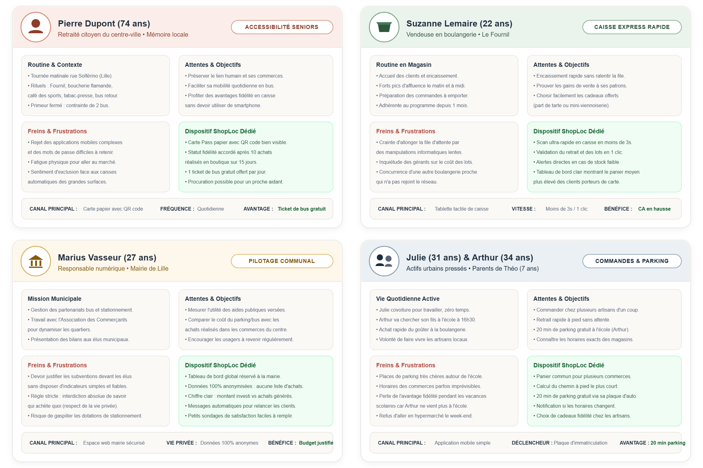

## 2.1. Démarche d'Analyse Usager & Cadre Méthodologique

L'ingénierie des exigences de ShopLoc repose sur une incarnation rigoureuse des acteurs du centre-ville pour concilier des profils variés : simplicité absolue pour les usagers non connectés, dynamisation physique des commerces sans commission, supervision éthique pour la mairie et flexibilité pour les familles actives.

La démarche UX retient des **fiches personas approfondies** et des **User Journey Maps chronologiques** conformes aux standards UX Justinmind :
* **Ancrage territorial réel** : Modélisation des habitudes pédestres et contraintes logistiques du centre lillois.
* **Parcours de bout en bout** : Déploiement des 5 phases séquentielles et des 6 niveaux d'expérience (actions, touchpoints, pensées, frictions, courbe émotionnelle, solutions).
* **Accessibilité universelle** : Zéro obligation de smartphone pour les seniors via un pass papier à QR code.

---

## 2.2. Cartographie Approfondie des 4 Personas Cibles

L'écosystème territorial s'articule autour de quatre archétypes majeurs couvrant le périmètre fonctionnel :

Figure 2.1 — Fiches des 4 Personas Approfondis (ShopLoc)

**Complémentarité Stratégique des Profils :** L'articulation entre Pierre (senior physique), Suzanne (commerce de bouche), Marius (décision publique) et Julie & Arthur (famille active) équilibre le modèle tripartite en combinant gratuité citoyenne, préservation des marges et vitalité piétonne.

## 2.3. Fiches Détaillées des Personas (Format Analyste Métier)

Chaque persona fait l'objet d'une caractérisation formalisée précisant ses routines, ses attentes, ses freins et la réponse opérationnelle apportée par ShopLoc.

| Persona & Profil | Canal Privilégié | Attente Prioritaire | Frein Majeur | Réponse Clé ShopLoc |
|---|---|---|---|---|
| **Pierre (74 ans)** Retraité centre-ville | Carte Pass Papier à QR code / NFC | Déplacement gratuit en bus et lien humain de proximité | Rejet des applications mobiles et peur de ralentir la caisse | Carte papier remise en main propre, 1 ticket bus/jour dès 10 achats/15j |
| **Suzanne (22 ans)** Vendeuse Fournil | Tablette tactile de caisse POS | Rapidité absolue d'encaissement (< 3s) sans bloquer la file | Crainte de lenteurs informatiques et du coût des lots marchands | Scan express en 1 geste, 0% commission, hausse du panier moyen prouvée |
| **Marius (27 ans)** DSI Ville de Lille | Espace web sécurisé Mairie | Justifier l'utilité des aides publiques auprès des élus | Interdiction stricte de traçage nominatif des paniers citoyens | Tableau de bord consolidé anonyme (investissements vs CA local généré) |
| **Julie & Arthur** Actifs & Parents | Application mobile & Plaque auto | Récupérer les achats et l'enfant sans stress de stationnement | Pénurie de places à 16h30 et perte des droits pendant les vacances | Panier Click & Collect groupé, 20 min parking offertes, gel estival bienveillant |

### Caractérisation Opérationnelle par Profil d'Acteur
* **Pierre Dupont (Retraité Citoyen, Lille Solférino) :** Réalise chaque matin sa tournée de proximité (pain au Fournil, boucherie flamande, café). La fermeture de son primeur lui impose des détours pénibles. ShopLoc lui remet une carte cartonnée gratuite à grand QR code : après 10 achats en boutique sur 15 jours glissants, 1 ticket de bus quotidien lui est automatiquement offert pour son retour.
* **Suzanne Lemaire (Vendeuse en Boulangerie, Le Fournil) :** Gère d'importantes pointes d'affluence le matin et à midi. ShopLoc met à sa disposition une application de caisse tactile ultra-rapide : la reconnaissance optique du pass s'effectue en moins de 3 secondes, et les commandes préparées sont remises en 1 clic au comptoir sans dégrader la fluidité du service.
* **Marius Vasseur (Responsable Numérique, Mairie de Lille) :** Coordonne la redynamisation avec les commerçants et la régie des transports. ShopLoc lui offre un tableau de bord macroscopique sans aucune visibilité sur les paniers individuels : les données agrégées permettent de mesurer l'impact direct des subventions de mobilité sur le commerce de proximité.
* **Julie & Arthur (Actifs Urbains, Parents de Théo, 7 ans) :** Julie compose un panier unique Click & Collect regroupant plusieurs artisans locaux durant sa journée. Arthur récupère son fils à l'école Jules Ferry à 16h30 : l'application active automatiquement 20 minutes de gratuité de voirie via sa plaque d'immatriculation. Les vacances scolaires n'entraînent aucune pénalité de fidélité.

## 2.4. Parcours Utilisateur Cible : Citoyen Présentiel & Mobilité (Pierre Dupont)

Le parcours de Pierre Dupont modélise l'expérience nominale d'un citoyen physique non connecté. Conçu selon le standard Justinmind, il détaille les 5 phases chronologiques et les 6 dimensions de l'expérience usager :

Figure 2.2 — User Journey Map : Parcours Citoyen Présentiel & Mobilité (Pierre Dupont, 74 ans)

### Déroulement Chronologique & Trajectoire Émotionnelle
* **Phase 1 (Découverte & Carte) :** Pierre remarque l'affiche chez Suzanne, qui lui remet sa carte cartonnée pré-imprimée en main propre. L'absence de compte web et d'identifiant dissipe immédiatement son appréhension face à la technologie.
* **Phase 2 (Tournée du matin) :** Pierre effectue son rituel de courses à pied rue Solférino, pleinement rassuré de conserver ses habitudes sans dépendance numérique.
* **Phase 3 (Achat & Scan caisse) :** En caisse, Suzanne scanne son pass optique en moins de 3 secondes. Pierre constate avec soulagement que l'opération ne ralentit absolument pas la file d'attente.
* **Phase 4 (Gain du ticket de bus) :** Ayant atteint le seuil de 10 achats sur 15 jours, son pass débloque automatiquement 1 ticket de bus gratuit par jour. Pierre rentre confortablement sans porter ses sacs lourds.
* **Phase 5 (Routine & Fidélité) :** Le geste devient une habitude valorisante. Le mécanisme de procuration garantit qu'un voisin pourra effectuer ses retraits en cas de fatigue ou d'alitement temporaire.

## 2.5. Parcours Utilisateur Cible : Actifs Urbains, Commandes & Mobilité (Julie & Arthur)

Ce parcours modélise la synchronisation opérationnelle entre la commande dématérialisée multi-boutiques et le stationnement gratuit de voirie lors de la sortie des classes à 16h30 :

Figure 2.3 — User Journey Map : Parcours Actifs Urbains, Commandes & Stationnement (Julie & Arthur)

### Déroulement Chronologique & Trajectoire Émotionnelle
* **Phase 1 (Inscription & Plaque) :** Julie crée son compte en 1 minute sur l'application mobile légère. Arthur enregistre la plaque d'immatriculation familiale pour activer le module de stationnement scolaire.
* **Phase 2 (Commande groupée) :** Julie sélectionne ses produits chez plusieurs artisans au sein d'un panier unique. L'application affiche les stocks réservés et le chemin piétonnier le plus court.
* **Phase 3 (Retrait & Goûter école) :** Julie retire ses paquets en 1 clic chez les commerçants. Arthur achète le goûter de Théo au Fournil en sortant de l'école, réalisant un achat direct complémentaire.
* **Phase 4 (Parking 20 min gratuit) :** À 16h30, l'application déclenche 20 minutes de stationnement gratuit autour de l'école. Arthur s'épargne la recherche d'un horodateur et tout risque de contravention.
* **Phase 5 (Fidélité & Vacances) :** Durant l'été, l'interruption des trajets scolaires ne provoque aucune déchéance de statut. Une notification bienveillante à la rentrée invite la famille à reprendre ses achats.

## 2.6. Dispositif d'Inclusion Sociale, Tiers de Confiance & Trajectoire de Release

### 1. Principes d'Inclusion Universelle & Souveraineté des Données
L'analyse des parcours confirme les trois piliers éthiques de la plateforme ShopLoc :
* **Gratuité citoyenne intégrale** : L'adhésion, la carte physique et l'application mobile sont strictement sans frais pour l'ensemble des usagers.
* **Inclusion universelle et lisibilité** : Les supports physiques et numériques garantissent des contrastes élevés, une typographie lisible et un grand QR code adapté à tous les publics.
* **Anonymat et protection de la vie privée** : Les achats ne sont jamais transmis nominativement aux services municipaux. Seuls des agrégats statistiques anonymes alimentent la décision publique.

### 2. Dispositif de Tiers de Confiance & Mandat de Retrait
Pour pallier les épisodes d'alitement, de mobilité réduite temporaire ou de fragilité des aînés, ShopLoc intègre un mécanisme sécurisé de procuration :
* **Délégation sans friction** : Le porteur d'une carte papier peut confier son pass à un proche aidant, un voisin de confiance ou un auxiliaire de vie pour effectuer ses retraits en boutique.
* **Sécurité des échanges** : La simple présentation matérielle du QR code autorise l'enregistrement de fidélité et la remise des commandes préparées, sans manipulation d'argent ni stockage bancaire.

### 3. Matrice de Planification par Version (V1 MVP, V2, V3)

Les exigences déduites des personas sont ordonnancées selon trois jalons de livraison :

| Fonctionnalité Déduite des Personas | Acteurs Bénéficiaires | Version Cible | Rôle & Justification Méthodologique |
|---|---|---|---|
| **Pass papier QR & Scan caisse rapide (< 3s)** | Pierre, Suzanne | **V1 (MVP Socle)** | Socle d'inclusion obligatoire dès l'origine pour intégrer les seniors et fluidifier la caisse. |
| **Panier Click & Collect multi-artisans** | Julie & Arthur, Suzanne | **V1 (MVP Socle)** | Cœur de valeur commercial permettant aux actifs de mutualiser leurs commandes locales. |
| **Statut VFP 15 jours & Gratuité Bus / Parking** | Pierre, Arthur, Marius | **V1 (MVP Socle)** | Mécanisme central de politique publique récompensant la régularité physique en boutique. |
| **Tableau de bord communal 100% anonymisé** | Marius | **V1 (MVP Socle)** | Supervision territoriale essentielle pour justifier l'allocation des fonds publics. |
| **Module formel de procuration tiers de confiance** | Pierre & Aidants | **V2 (Confort & Entraide)** | Traçabilité optionnelle du mandataire garantissant une sérénité totale en cas d'alitement. |
| **Gestion intelligente de la saisonnalité scolaire** | Julie & Arthur | **V2 (Confort & Entraide)** | Algorithme de suspension temporaire des exigences de passage pendant les vacances. |
| **Couplage billettique dématérialisée NFC avancée** | Tous profils | **V3 (Écosystème Étendu)** | Intégration matérielle directe avec les valideurs de transport et horodateurs de voirie. |

---

*L'ensemble des exigences et parcours formalisés dans cette section constitue la source directe de la modélisation des processus métiers de l'Étape 03 (Processus BPMN).*
