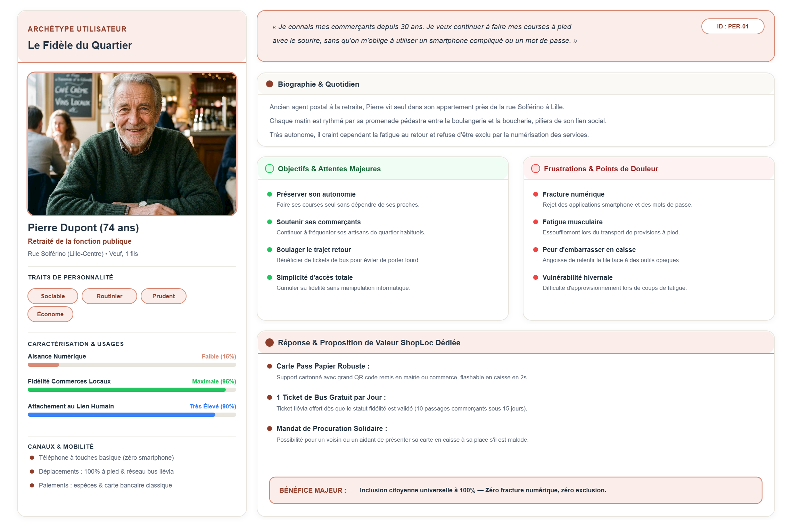
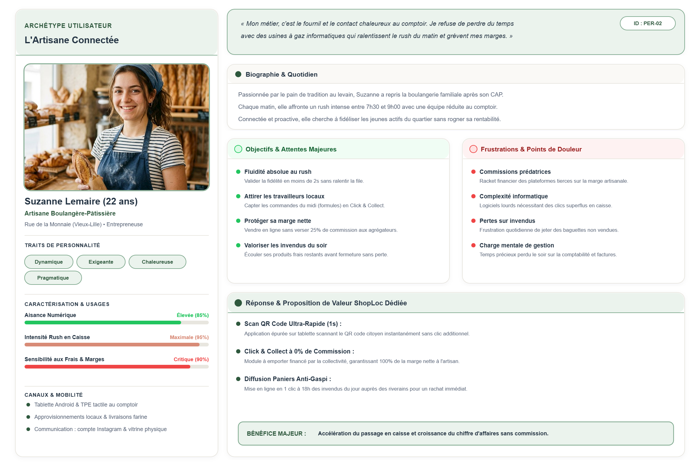
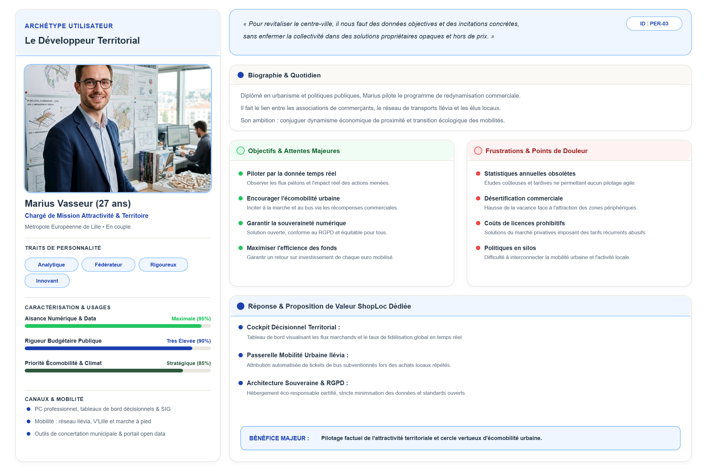
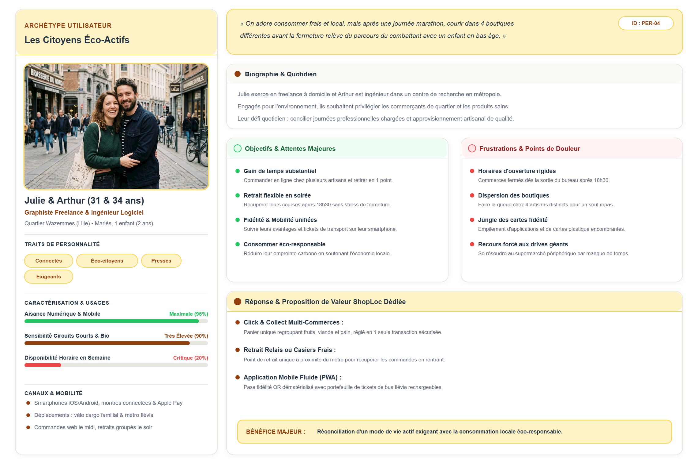
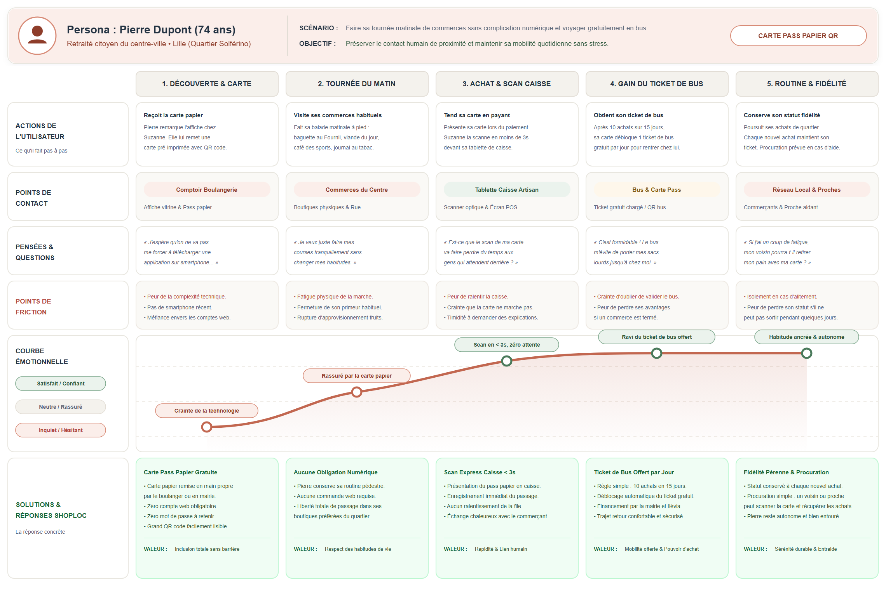
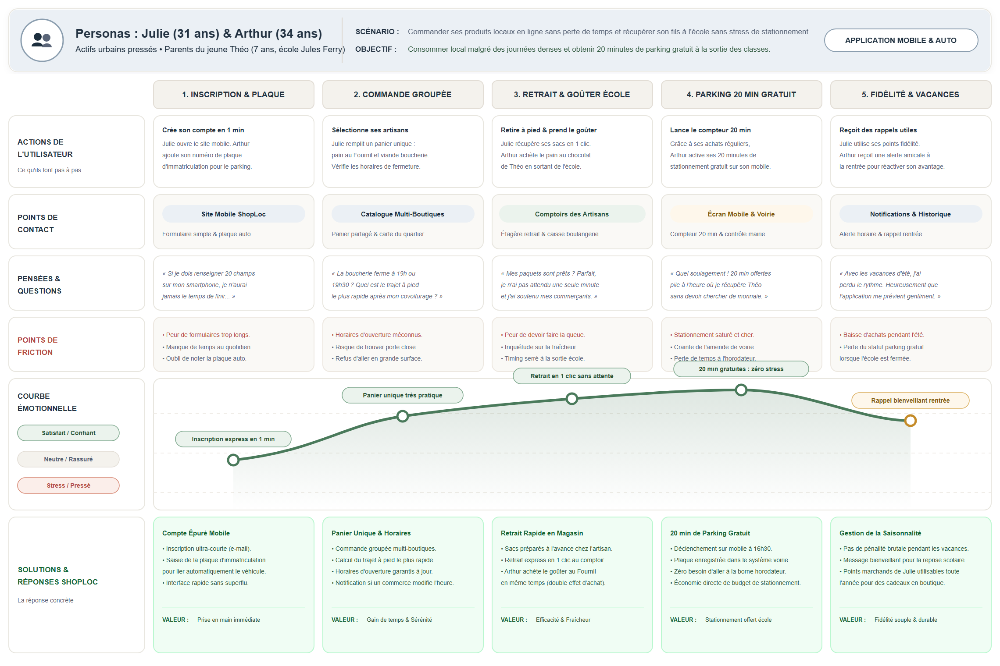

## 2.1. Démarche d'Analyse Usager & Cadre Méthodologique

L'ingénierie des exigences de ShopLoc repose sur une incarnation rigoureuse des acteurs du centre-ville. Conformément aux orientations stratégiques définies en Section 01, la plateforme doit concilier des attentes hétérogènes : préserver la simplicité absolue pour les usagers éloignés du numérique, optimiser la rentabilité des commerçants de proximité sans commission, fournir aux collectivités un outil de pilotage éthique, et répondre à la contrainte de temps des actifs urbains.

Afin de garantir une modélisation directement exploitable pour les étapes ultérieures (processus BPMN et modèle conceptuel de données), la démarche UX écarte délibérément les cartes d'empathie superficielles au profit de **fiches personas approfondies** et de **User Journey Maps chronologiques complètes** conformes aux standards de conception UX (Justinmind) :
* **Un ancrage territorial réel** : Modélisation des contraintes logistiques, des habitudes de déplacement pédestres et des canaux d'accès de chaque profil sur le bassin de vie lillois.
* **Une modélisation nominale de bout en bout** : Description des 5 phases séquentielles de l'expérience usager (découverte, préparation, interaction physique, gratification mobilité, fidélisation pérenne) et des 6 niveaux d'analyse (actions, touchpoints, pensées, irritants, courbe émotionnelle, solutions fonctionnelles).
* **Une accessibilité universelle sans barrière** : Exclusion de toute obligation de posséder un smartphone pour les usagers seniors, via un support physique en carton à QR code.

---

## 2.2. Cartographie Approfondie des 4 Personas Cibles

L'écosystème territorial s'articule autour de quatre archétypes majeurs couvrant l'intégralité du périmètre fonctionnel :
* **Pierre Dupont (74 ans, Citoyen Senior)** : Retraité centre-ville, tournée pédestre matinale rue Solférino, carte papier QR/NFC, 1 ticket de bus offert/jour dès 10 achats en 15 jours, procuration tiers de confiance.
* **Suzanne Lemaire (22 ans, Commerçante Artisanale)** : Vendeuse en boulangerie (*Le Fournil*), tablette caisse tactile POS, scan express < 3s, validation en 1 clic, tableau de bord CA en hausse.
* **Marius Vasseur (27 ans, Collectivité Mairie)** : Responsable numérique municipal, portail web communal, indicateurs agrégés 100% anonymisés, évaluation de l'impact des subventions publiques.
* **Julie (31 ans) & Arthur (34 ans, Actifs Urbains)** : Parents du jeune Théo (7 ans, école Jules Ferry), panier groupé multi-artisans, 20 min de stationnement école offertes via plaque d'immatriculation.

*Les figures 2.1a à 2.1d ci-après présentent les fiches complètes de chacun des 4 profils en format paysage pleine page autonome.*

  

    <strong style="font-size: 11pt; color: var(--color-brand-primary);">Figure 2.1a — Fiche Persona Approfondie : Pierre Dupont (74 ans, Retraité Citoyen du Centre-Ville)</strong>
  

  

    
  

  

    <strong style="font-size: 11pt; color: var(--color-brand-primary);">Figure 2.1b — Fiche Persona Approfondie : Suzanne Lemaire (22 ans, Vendeuse en Boulangerie)</strong>
  

  

    
  

  

    <strong style="font-size: 11pt; color: var(--color-brand-primary);">Figure 2.1c — Fiche Persona Approfondie : Marius Vasseur (27 ans, Responsable Numérique Mairie)</strong>
  

  

    
  

  

    <strong style="font-size: 11pt; color: var(--color-brand-primary);">Figure 2.1d — Fiche Persona Approfondie : Julie &amp; Arthur (31/34 ans, Actifs Urbains &amp; Parents)</strong>
  

  

    
  

## 2.3. Fiches Détaillées des Personas (Format Analyste Métier)

Chaque persona fait l'objet d'une caractérisation formalisée précisant ses routines, ses attentes, ses freins et la réponse opérationnelle apportée par ShopLoc.

| Persona & Profil | Canal Privilégié | Attente Prioritaire | Frein Majeur | Réponse Clé ShopLoc |
|---|---|---|---|---|
| **Pierre (74 ans)** Retraité centre-ville | Carte Pass Papier à QR code / NFC | Déplacement gratuit en bus et lien humain de proximité | Rejet des applications mobiles et peur de ralentir la caisse | Carte papier remise en main propre, 1 ticket bus/jour dès 10 achats/15j |
| **Suzanne (22 ans)** Vendeuse Fournil | Tablette tactile de caisse POS | Rapidité absolue d'encaissement (< 3s) sans bloquer la file | Crainte de lenteurs informatiques et du coût des lots marchands | Scan express en 1 geste, 0% commission, hausse du panier moyen prouvée |
| **Marius (27 ans)** DSI Ville de Lille | Espace web sécurisé Mairie | Justifier l'utilité des aides publiques auprès des élus | Interdiction stricte de traçage nominatif des paniers citoyens | Tableau de bord consolidé anonyme (investissements vs CA local généré) |
| **Julie & Arthur** Actifs & Parents | Application mobile & Plaque auto | Récupérer les achats et l'enfant sans stress de stationnement | Pénurie de places à 16h30 et perte des droits pendant les vacances | Panier Click & Collect groupé, 20 min parking offertes, gel estival bienveillant |

### Caractérisation Opérationnelle par Profil d'Acteur
* **Pierre Dupont (Retraité Citoyen, Lille Solférino) :** Réalise chaque matin sa tournée de proximité (pain au Fournil, boucherie flamande, café). La fermeture de son primeur lui impose des détours pénibles. ShopLoc lui remet une carte cartonnée gratuite à grand QR code : après 10 achats en boutique sur 15 jours glissants, 1 ticket de bus quotidien lui est automatiquement offert pour son retour.
* **Suzanne Lemaire (Vendeuse en Boulangerie, Le Fournil) :** Gère d'importantes pointes d'affluence le matin et à midi. ShopLoc met à sa disposition une application de caisse tactile ultra-rapide : la reconnaissance optique du pass s'effectue en moins de 3 secondes, et les commandes préparées sont remises en 1 clic au comptoir sans dégrader la fluidité du service.
* **Marius Vasseur (Responsable Numérique, Mairie de Lille) :** Coordonne la redynamisation avec les commerçants et la régie des transports. ShopLoc lui offre un tableau de bord macroscopique sans aucune visibilité sur les paniers individuels : les données agrégées permettent de mesurer l'impact direct des subventions de mobilité sur le commerce de proximité.
* **Julie & Arthur (Actifs Urbains, Parents de Théo, 7 ans) :** Julie compose un panier unique Click & Collect regroupant plusieurs artisans locaux durant sa journée. Arthur récupère son fils à l'école Jules Ferry à 16h30 : l'application active automatiquement 20 minutes de gratuité de voirie via sa plaque d'immatriculation. Les vacances scolaires n'entraînent aucune pénalité de fidélité.

  

    <strong style="font-size: 11pt; color: var(--color-brand-primary);">Figure 2.2 — User Journey Map : Parcours Citoyen Présentiel & Mobilité (Pierre Dupont, 74 ans)</strong>
  

  

    
  

## 2.4. Analyse Analytique du Parcours Usager : Pierre Dupont

Le parcours de Pierre Dupont modélise l'expérience d'un citoyen physique non connecté. Conçu selon le standard Justinmind (Figure 2.2 ci-avant), il détaille les 5 phases chronologiques et les 6 dimensions de l'expérience usager :

### 1. Déroulement Chronologique & Trajectoire Émotionnelle
* **Phase 1 (Découverte & Carte) :** Pierre remarque l'affiche chez Suzanne, qui lui remet sa carte cartonnée pré-imprimée en main propre. L'absence de compte web et d'identifiant dissipe immédiatement son appréhension face à la technologie.
* **Phase 2 (Tournée du matin) :** Pierre effectue son rituel de courses à pied rue Solférino, pleinement rassuré de conserver ses habitudes sans dépendance numérique.
* **Phase 3 (Achat & Scan caisse) :** En caisse, Suzanne scanne son pass optique en moins de 3 secondes. Pierre constate avec soulagement que l'opération ne ralentit absolument pas la file d'attente.
* **Phase 4 (Gain du ticket de bus) :** Ayant atteint le seuil de 10 achats sur 15 jours, son pass débloque automatiquement 1 ticket de bus gratuit par jour. Pierre rentre confortablement sans porter ses sacs lourds.
* **Phase 5 (Routine & Fidélité) :** Le geste devient une habitude valorisante. Le mécanisme de procuration garantit qu'un voisin pourra effectuer ses retraits en cas de fatigue ou d'alitement temporaire.

### 2. Matrice des Points de Friction et Réponses Opérationnelles

| Phase du Parcours | Point de Friction Usager | Solution Opérationnelle ShopLoc |
|---|---|---|
| **Découverte** | Peur de la complexité technique et rejet des applications | Carte papier gratuite remise en main propre, zéro compte web |
| **Tournée** | Fatigue physique de la marche suite à la fermeture du primeur | Trajet de quartier valorisé, maintien de la mobilité autonome |
| **Caisse** | Crainte d'allonger l'attente et de gêner les autres clients | Scan optique instantané (< 3s) intégré au rituel de paiement |
| **Transport** | Crainte d'oublier de valider ou de manipuler des bornes | Droit au bus automatiquement associé au pass, partenariat régie |
| **Fidélisation** | Crainte de perdre son statut en cas d'incapacité temporaire | Maintien simple du statut, délégation d'achat par procuration |

  

    <strong style="font-size: 11pt; color: var(--color-brand-primary);">Figure 2.3 — User Journey Map : Parcours Actifs Urbains, Commandes & Stationnement (Julie & Arthur)</strong>
  

  

    
  

## 2.5. Analyse Analytique du Parcours Usager : Julie & Arthur

Ce parcours modélise la synchronisation opérationnelle entre la commande dématérialisée multi-boutiques et le stationnement gratuit de voirie lors de la sortie des classes à 16h30 (Figure 2.3 ci-avant) :

### 1. Déroulement Chronologique & Trajectoire Émotionnelle
* **Phase 1 (Inscription & Plaque) :** Julie crée son compte en 1 minute sur l'application mobile légère. Arthur enregistre la plaque d'immatriculation familiale pour activer le module de stationnement scolaire.
* **Phase 2 (Commande groupée) :** Julie sélectionne ses produits chez plusieurs artisans au sein d'un panier unique. L'application affiche les stocks réservés et le chemin piétonnier le plus court.
* **Phase 3 (Retrait & Goûter école) :** Julie retire ses paquets en 1 clic chez les commerçants. Arthur achète le goûter de Théo au Fournil en sortant de l'école, réalisant un achat direct complémentaire.
* **Phase 4 (Parking 20 min gratuit) :** À 16h30, l'application déclenche 20 minutes de stationnement gratuit autour de l'école. Arthur s'épargne la recherche d'un horodateur et tout risque de contravention.
* **Phase 5 (Fidélité & Vacances) :** Durant l'été, l'interruption des trajets scolaires ne provoque aucune déchéance de statut. Une notification bienveillante à la rentrée invite la famille à reprendre ses achats.

### 2. Matrice des Points de Friction et Réponses Opérationnelles

| Phase du Parcours | Point de Friction Usager | Solution Opérationnelle ShopLoc |
|---|---|---|
| **Inscription** | Répulsion face aux longs formulaires d'enregistrement | Formulaire épuré en 3 champs, liaison directe avec la voirie |
| **Commande** | Horaires de fermeture incertains et dispersion des magasins | Panier centralisé multi-boutiques, horaires garantis à jour |
| **Retrait** | Peur de faire la queue aux heures d'affluence | Retrait rapide en boutique, sacs préparés en amont |
| **Stationnement** | Saturation de la voirie scolaire et peur des amendes | 20 min offertes à 16h30, contrôle automatisé par plaque auto |
| **Saisonnalité** | Perte punitive de la fidélité pendant les vacances | Gel souple des fenêtres d'achat, réactivation amicale en septembre |

## 2.6. Dispositif d'Inclusion Sociale, Tiers de Confiance & Trajectoire de Release

### 1. Principes d'Inclusion Universelle & Souveraineté des Données
L'analyse des parcours confirme les trois piliers éthiques de la plateforme ShopLoc :
* **Gratuité citoyenne intégrale** : L'adhésion, la carte physique et l'application mobile sont strictement sans frais pour l'ensemble des usagers.
* **Inclusion universelle et lisibilité** : Les supports physiques et numériques garantissent des contrastes élevés, une typographie lisible et un grand QR code adapté à tous les publics.
* **Anonymat et protection de la vie privée** : Les achats ne sont jamais transmis nominativement aux services municipaux. Seuls des agrégats statistiques anonymes alimentent la décision publique.

### 2. Dispositif de Tiers de Confiance & Mandat de Retrait
Pour pallier les épisodes d'alitement, de mobilité réduite temporaire ou de fragilité des aînés, ShopLoc intègre un mécanisme sécurisé de procuration :
* **Délégation sans friction** : Le porteur d'une carte papier peut confier son pass à un proche aidant, un voisin de confiance ou un auxiliaire de vie pour effectuer ses retraits en boutique.
* **Sécurité des échanges** : La simple présentation matérielle du QR code autorise l'enregistrement de fidélité et la remise des commandes préparées, sans manipulation d'argent ni stockage bancaire.

### 3. Matrice de Planification par Version (V1 MVP, V2, V3)

Les exigences déduites des personas sont ordonnancées selon trois jalons de livraison :

| Fonctionnalité Déduite des Personas | Acteurs Bénéficiaires | Version Cible | Rôle & Justification Méthodologique |
|---|---|---|---|
| **Pass papier QR & Scan caisse rapide (< 3s)** | Pierre, Suzanne | **V1 (MVP Socle)** | Socle d'inclusion obligatoire dès l'origine pour intégrer les seniors et fluidifier la caisse. |
| **Panier Click & Collect multi-artisans** | Julie & Arthur, Suzanne | **V1 (MVP Socle)** | Cœur de valeur commercial permettant aux actifs de mutualiser leurs commandes locales. |
| **Statut VFP 15 jours & Gratuité Bus / Parking** | Pierre, Arthur, Marius | **V1 (MVP Socle)** | Mécanisme central de politique publique récompensant la régularité physique en boutique. |
| **Tableau de bord communal 100% anonymisé** | Marius | **V1 (MVP Socle)** | Supervision territoriale essentielle pour justifier l'allocation des fonds publics. |
| **Module formel de procuration tiers de confiance** | Pierre & Aidants | **V2 (Confort & Entraide)** | Traçabilité optionnelle du mandataire garantissant une sérénité totale en cas d'alitement. |
| **Gestion intelligente de la saisonnalité scolaire** | Julie & Arthur | **V2 (Confort & Entraide)** | Algorithme de suspension temporaire des exigences de passage pendant les vacances. |
| **Couplage billettique dématérialisée NFC avancée** | Tous profils | **V3 (Écosystème Étendu)** | Intégration matérielle directe avec les valideurs de transport et horodateurs de voirie. |

---

*L'ensemble des exigences et parcours formalisés dans cette section constitue la source directe de la modélisation des processus métiers de l'Étape 03 (Processus BPMN).*
