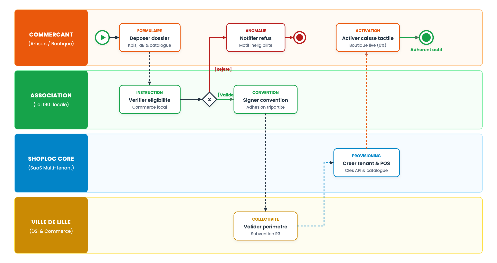
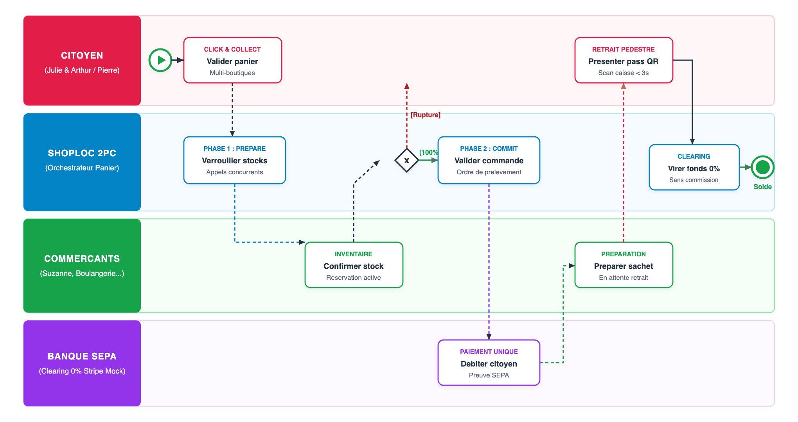
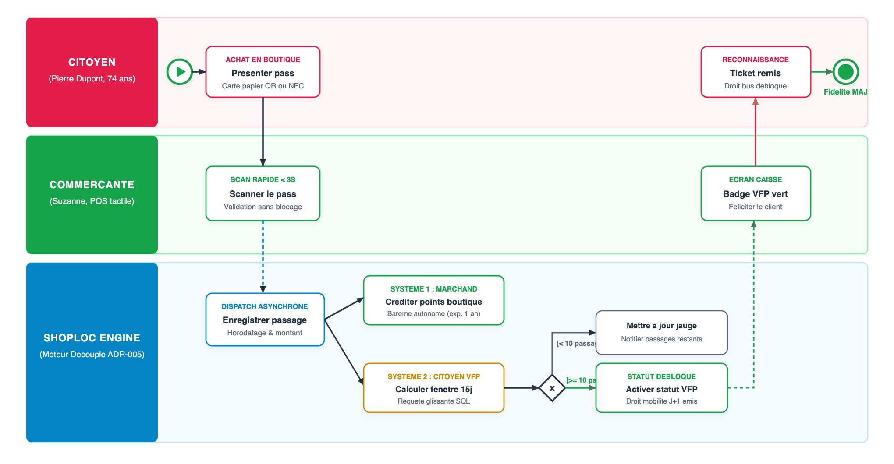
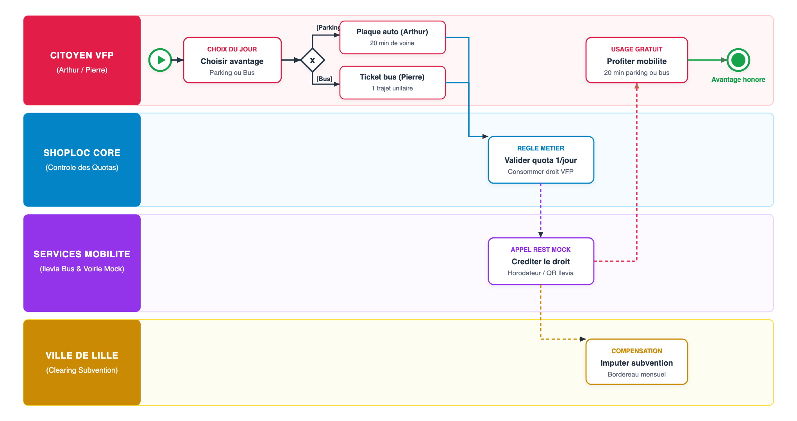
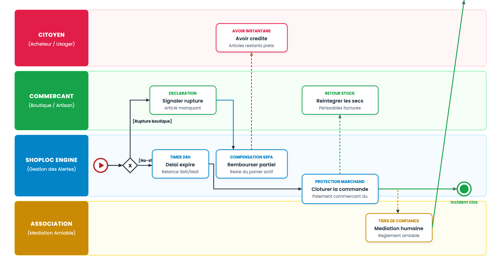

## 3.1. Cadre Méthodologique BPMN 2.0 & Sémantique des Couloirs

La modélisation applique la norme internationale **BPMN 2.0 (ISO/IEC 19510)** pour orchestrer les flux entre les acteurs du centre-ville, structurés en **quatre couloirs sémantiques étanches (swimlanes)** :
* **Citoyen (Consommateur & Usager)** : Parcours présentiel en boutique (Pierre) ou commande Click & Collect (Julie & Arthur).
* **Commerçant Partenaire** : Inventaire, préparation des sachets et validation tactile en caisse (Suzanne).
* **Plateforme ShopLoc (Cœur Transactionnel)** : Consensus 2PC, double moteur de fidélité et isolation multi-tenant.
* **Services Partenaires (Ville de Lille & Mobilité)** : APIs de voirie, régie de transport Ilevia et clearing bancaire SEPA.

---

## 3.2. Processus P1 : Conventionnement Municipal & Adhésion Commerçante

Le processus P1 régit l'intégration tripartite (Mairie, Association, Artisan) garantissant le modèle sans commission (ADR-004).

Figure 3.1 — Processus P1 : Conventionnement Municipal, Adhésion Commerçante & Déblocage SaaS

* **Instruction & Adhésion** : L'Association valide l'éligibilité locale (Kbis, RIB). En cas de conformité, la convention tripartite est signée.
* **Provisioning & Zéro Commission** : La Mairie valide la subvention ; ShopLoc déploie le tenant isolé et la clé de caisse POS (0% marchand).

## 3.3. Processus P2 : Commande Click & Collect Multi-Boutiques & Retrait (Two-Phase Commit)

Le processus P2 modélise l'achat d'un panier mutualisé multi-boutiques régi par le protocole transactionnel distribué **Two-Phase Commit (2PC)** pour éliminer tout risque de débit citoyen sans réservation confirmée de l'ensemble des stocks marchands.

Figure 3.2 — Processus P2 : Commande Click & Collect Multi-Boutiques & Retrait (Two-Phase Commit)

### Cinématique Transactionnelle & Retrait Pédestre
* **Phase 1 (Prepare / Verrouillage concurrent)** : ShopLoc vérifie et bloque les stocks en parallèle auprès de chaque commerçant.
* **Phase 2 (Commit / Paiement unique & ensachage)** : En cas d'accord unanime, prélèvement bancaire unique SEPA et émission des ordres d'ensachage.
* **Retrait en Boutique & Scan Express (< 3s)** : L'usager présente son pass optique en boutique. Le scan délivre le sachet et vire 100% des fonds nets.

## 3.4. Processus P3 : Passage en Caisse Physique & Double Moteur de Fidélité Découplé

Conformément à l'**ADR-005**, ShopLoc découple strictement les points d'achat marchands de la régularité citoyenne VFP.

Figure 3.3 — Processus P3 : Passage en Caisse Physique & Double Moteur de Fidélité Découplé (ADR-005)

### Découplage Algorithmique & Ergonomie en Caisse
* **Système 1 (Fidélité Marchande Autonome)** : Crédit de points propre au Fournil selon son barème libre (validité 12 mois glissants).
* **Système 2 (Fidélité Citoyenne VFP par Régularité)** : Enregistrement du passage physique sans condition de montant. Analyse SQL sur fenêtre glissante de 15 jours calendaires : dès 10 passages atteints, activation du statut VFP et émission d'un voucher mobilité pour le lendemain.
* **Fluidité au Comptoir (< 3s)** : Scan optique instantané du pass papier ou mobile ; l'écran affiche le badge VFP vert sans ralentir la file.

## 3.5. Processus P4 : Conversion des Droits de Fidélité VFP en Mobilité Urbaine

Le processus P4 concrétise la subvention municipale en convertissant la régularité de proximité en mobilités douces métropolitaines.

Figure 3.4 — Processus P4 : Conversion des Droits VFP en Mobilité Municipale Subventionnée

### Interfaçage API & Compensation Financière
* **Arbitrage Quotidien Citoyen** : Tout détenteur VFP choisit son avantage quotidien (quota strict de 1 avantage par jour calendaire).
* **Consommation en Temps Réel via Mocks RESTful** :
  - *Stationnement de voirie* : Saisie de plaque (Arthur) ; ShopLoc crédite 20 minutes gratuites directement sur l'API de voirie.
  - *Transports urbains* : Génération d'un e-ticket QR code Ilevia (Pierre) pour 1 voyage métropolitain immédiat.
* **Compensation Budgétaire** : ShopLoc consolide les consommations et transmet un bordereau mensuel à la Mairie pour règlement aux régies.

## 3.6. Processus P5 : Traitement des Anomalies, Ruptures de Stock & No-Show

Le processus P5 encadre la résilience opérationnelle face aux aléas de stock, annulations et oublis de retrait en boutique.

Figure 3.5 — Processus P5 : Traitement des Anomalies, Ruptures de Stock, Annulations & No-Show

* **Rupture Partielle** : Avoir immédiat sans altérer la commande chez les commerçants voisins du panier mutualisé.
* **Règle de Garde 24h & No-Show** : Notification de rappel. À H+24, le paiement est maintenu pour le commerçant sur les denrées périssables, et les produits secs sont réintégrés en stock. L'Association intervient en médiateur amiable en cas de contestation.

---

## 3.7. Matrice de Résilience & Robustesse Transactionnelle des Processus

| Réf. | Intitulé du Processus | Fréquence / Volume | Contrainte (SLA) | Mécanisme de Résilience & Sécurité |
|---|---|---|---|---|
| **P1** | Conventionnement & Déblocage | Ponctuel (par boutique) | Activation &lt; 48h | Double validation Association/Mairie + Tenant chiffré |
| **P2** | Commande Click &amp; Collect 2PC | Centaines / jour | Consensus &lt; 500 ms | Verrouillage distribué + Rollback automatique si rupture |
| **P3** | Caisse Physique &amp; Double Fidélité | Milliers / jour | Scan optique &lt; 3s | Découplage SQL asynchrone (points marchands vs VFP 15j) |
| **P4** | Conversion Mobilité Municipale | 1 / jour / usager VFP | Émission &lt; 1s | Quota strict 1/jour + Mocks RESTful voirie et bus |
| **P5** | Gestion Incidents &amp; No-Show | Exceptionnel (&lt; 2%) | Alerte timer H+24 | Rémunération garantie sur périssables + Médiation locale |
