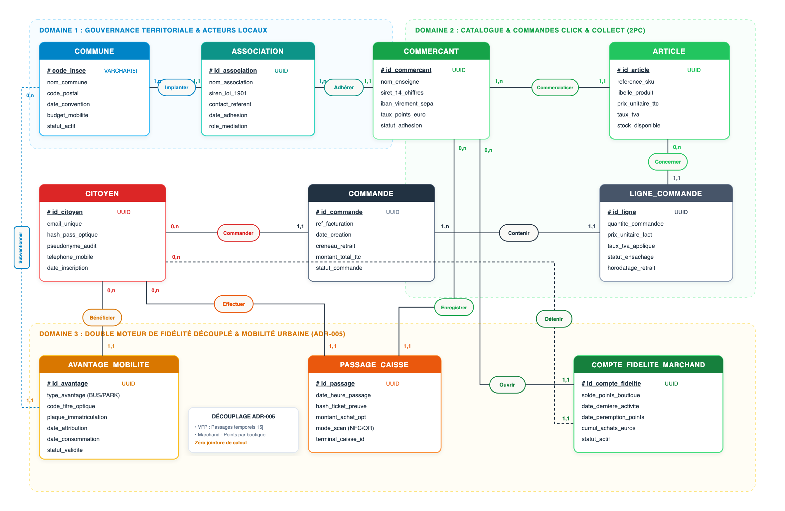

## 4.1. Cadre Méthodologique Merise & Architecture Conceptuelle Globale

La modélisation applique la méthode formelle **Merise (norme AFNOR)** pour structurer le patrimoine informationnel du système ShopLoc en amont de son implémentation dans le SGBD relationnel PostgreSQL. L'approche garantit la **3e Forme Normale (3FN)** en éliminant toute dépendance transitive et redondance fonctionnelle.

Le modèle conceptuel s'articule autour de **dix entités canoniques** réparties en **trois domaines étanches** :
* **Domaine 1 : Gouvernance Territoriale & Acteurs** : Conventionnement tripartite municipal (Mairie, Association de commerçants, Artisans) et compte citoyen universel.
* **Domaine 2 : Catalogue Marchand & Commandes Click & Collect** : Stocks manuels V1, panier mutualisé multi-boutiques et protocole Two-Phase Commit (2PC).
* **Domaine 3 : Double Moteur de Fidélité Découplé & Mobilité Urbaine** : Indépendance stricte (ADR-005) entre la fidélité marchande autonome par points et la régularité citoyenne VFP calculée sur fenêtre glissante de 15 jours.

<div class="diagram-container" style="margin: 2pt 0;">
  
  <div class="diagram-caption">Figure 4.1 — Modèle Conceptuel de Données (MCD Merise) &amp; Découplage des Moteurs de Fidélité (ADR-005)</div>
</div>

### Découplage Architectural & Isolation Multi-Tenant (ADR-005 & ADR-012)
* **Découplage strict des moteurs** : Aucune liaison de jointure directe n'existe entre `COMPTE_FIDELITE_MARCHAND` et `AVANTAGE_MOBILITE`. Le statut VFP dépend uniquement de la présence temporelle consignée dans `PASSAGE_CAISSE`.
* **Cloisonnement territorial** : Le discriminant souverain `code_insee` assure l'étanchéité multi-tenant entre communes, prévenant toute fuite de données ou compensation croisée non autorisée.

<div style="page-break-before: always;"></div>

## 4.2. Dictionnaire Formel des Données — Gouvernance Territoriale & Acteurs

Le premier sous-domaine formalise l'ancrage institutionnel de ShopLoc (ADR-004), liant la collectivité délégante, l'association commerçante de proximité et les usagers finaux dans un cadre de confiance auditable.

| Entité (Table) | Clé Primaire [PK] | Clés Étrangères [FK] | Attributs Métier &amp; Types Logiques | Contraintes d'Intégrité &amp; Règles RGPD |
|---|---|---|---|---|
| **COMMUNE** | `code_insee` (VARCHAR 5) | — | `nom_commune` (VARCHAR 100), `code_postal` (VARCHAR 5), `date_convention` (DATE), `budget_mobilite` (DECIMAL 12,2) | Clé souveraine INSEE. Partitionnement multi-tenant. `budget_mobilite >= 0`. |
| **ASSOCIATION** | `id_association` (UUID) | `code_insee` | `nom_association` (VARCHAR 120), `siren_loi_1901` (VARCHAR 9), `contact_referent` (VARCHAR 100), `date_adhesion` (DATE) | `siren` UNIQUE (9 car.). Structure loi 1901 locale assurant la médiation terrain. |
| **COMMERCANT** | `id_commercant` (UUID) | `id_association` | `nom_enseigne` (VARCHAR 100), `siret_14` (VARCHAR 14), `iban_sepa` (VARCHAR 34), `taux_points_euro` (DECIMAL 4,2), `statut` (ENUM) | `siret` UNIQUE (14 car.). IBAN chiffré au repos pour reversement net à 0% commission. |
| **CITOYEN** | `id_citoyen` (UUID) | — | `email_unique` (VARCHAR 150), `hash_pass_optique` (VARCHAR 64), `pseudonyme_audit` (VARCHAR 50), `telephone` (VARCHAR 15) | `email` UNIQUE. `hash_pass_optique` haché SHA-256 salé. Données nominatives isolées. |

### Caractérisation des Règles de Gestion du Domaine Acteurs (Format Analyste)
* **RG-ACT-01 : Souveraineté territoriale & Cloisonnement multi-tenant (Commune)**  
  *Énoncé :* Chaque enregistrement de boutique ou d'association est rattaché de manière exclusive à un code INSEE territorial.  
  *Explication :* Garantit l'étanchéité stricte des données entre communes partenaires. Les rapports municipaux (Marius) n'agrègent que les données du périmètre communal sans visibilité sur les communes limitrophes.
* **RG-ACT-02 : Tiers de confiance associatif & Instruction terrain (Association)**  
  *Énoncé :* L'adhésion commerçante est validée par l'association locale avant l'ouverture du compte SaaS.  
  *Explication :* L'association vérifie la conformité juridique (Kbis, bail commercial en centre-ville) et signe la convention tripartite, préservant le modèle sans commission prélevée sur le commerçant.
* **RG-ACT-03 : Reversement bancaire intégral SEPA (Commerçant)**  
  *Énoncé :* 100% des montants des commandes Click &amp; Collect réglées en ligne sont virés au commerçant.  
  *Explication :* ShopLoc n'applique aucun prélèvement à la transaction. Les virements sont consolidés hebdomadairement vers l'IBAN professionnel certifié.
* **RG-ACT-04 : Pseudonymisation native & Hachage salé des supports optiques (Citoyen)**  
  *Énoncé :* Aucun support physique (carte papier QR ou badge mobile) ne stocke d'information citoyenne en clair.  
  *Explication :* Seule l'empreinte cryptographique SHA-256 salée est persistée dans `hash_pass_optique`. Les données de connexion sont chiffrées (AES-256) et inaccessibles aux autres acteurs.

<div style="page-break-before: always;"></div>

## 4.3. Dictionnaire Formel des Données — Catalogue & Commandes Click & Collect

Le deuxième sous-domaine régit le catalogue décentralisé et le panier mutualisé multi-boutiques sous protocole Two-Phase Commit (2PC).

| Entité (Table) | Clé Primaire [PK] | Clés Étrangères [FK] | Attributs Métier &amp; Types Logiques | Contraintes d'Intégrité &amp; Règles C&amp;C |
|---|---|---|---|---|
| **ARTICLE** | `id_article` (UUID) | `id_commercant` | `reference_sku` (VARCHAR 50), `libelle_produit` (VARCHAR 120), `prix_unitaire_ttc` (DECIMAL 10,2), `taux_tva` (DECIMAL 4,2), `stock_disponible` (INT) | `stock >= 0`. Masquage automatique si stock nul. `ON DELETE RESTRICT` si lié à commande. |
| **COMMANDE** | `id_commande` (UUID) | `id_citoyen` | `ref_facturation` (VARCHAR 24), `date_creation` (TIMESTAMP), `creneau_retrait` (TIMESTAMP), `montant_total_ttc` (DECIMAL 10,2), `statut` (ENUM) | `ref_facturation` UNIQUE. Débit bancaire unique SEPA. États 2PC : `PREPARE`, `COMMIT`, `RETIREE`, `NO_SHOW`. |
| **LIGNE_COMMANDE** | `id_ligne` (UUID) | `id_commande`, `id_article` | `quantite_commandee` (INT), `prix_unitaire_fact` (DECIMAL 10,2), `taux_tva_applique` (DECIMAL 4,2), `statut_ensachage` (ENUM) | **Snapshot inaltérable** du tarif catalogue. `quantite > 0`. Clé étrangère en cascade sur commande. |

### Caractérisation des Règles de Gestion du Domaine Commandes (Format Analyste)
* **RG-CMD-01 : Gestion de stock manuel V1 & Consensus distribué (Article)**  
  *Énoncé :* Les articles font l'objet d'un ajustement manuel par le commerçant et d'un verrouillage en Phase 1 2PC.  
  *Explication :* Lors de la validation du panier, le système vérifie simultanément la disponibilité des stocks chez tous les commerçants concernés. En cas de rupture partielle, une alternative ou un remboursement immédiat est émis sans bloquer le reste de la commande.
* **RG-CMD-02 : Panier mutualisé multi-commerces & Retrait coordonné (Commande)**  
  *Énoncé :* L'usager compose un panier unique inter-boutiques et réalise un prélèvement bancaire globalisé.  
  *Explication :* L'application génère un itinéraire de retrait piétonnier ordonnancé selon les horaires d'ouverture des boutiques. La commande est ventilée en ordres de préparation indépendants dans chaque commerce.
* **RG-CMD-03 : Inaltérabilité comptable par snapshotting des tarifs (Ligne Commande)**  
  *Énoncé :* Le prix unitaire et la TVA facturés sont figés au moment du paiement de la commande.  
  *Explication :* Sanctuarise la valeur transactionnelle contre toute modification tarifaire ultérieure effectuée par l'artisan dans son catalogue, garantissant la conformité de la comptabilité marchande.
* **RG-CMD-04 : Règle de garde 24h & Sécurisation financière en cas de No-Show (ADR-006)**  
  *Énoncé :* Tout panier non réclamé dans le créneau imparti demeure acquis au commerçant après un délai de garde de 24h.  
  *Explication :* Protège les artisans des pertes sur denrées périssables fraîches. À H+24, le paiement est confirmé au marchand et les articles secs sont remis en inventaire.

<div style="page-break-before: always;"></div>

## 4.4. Dictionnaire Formel des Données — Double Moteur de Fidélité & Mobilité Urbaine

Le troisième sous-domaine matérialise le cœur algorithmique de fidélité de ShopLoc en garantissant le découplage étanche formalisé dans l'**ADR-005**.

| Entité (Table) | Clé Primaire [PK] | Clés Étrangères [FK] | Attributs Métier &amp; Types Logiques | Contraintes d'Intégrité &amp; Découplage |
|---|---|---|---|---|
| **PASSAGE_CAISSE** | `id_passage` (UUID) | `id_citoyen`, `id_commercant` | `date_heure_passage` (TIMESTAMP), `hash_ticket_preuve` (VARCHAR 64), `montant_achat_opt` (DECIMAL 10,2), `mode_scan` (ENUM) | Scan express (&lt; 3s). `montant_achat_opt` sans influence sur le statut VFP communal. |
| **COMPTE_FIDELITE**<br>`_MARCHAND` | `id_compte_fidelite` (UUID) | `id_citoyen`, `id_commercant` | `solde_points_boutique` (INT), `date_derniere_activite` (DATE), `date_peremption_points` (DATE), `cumul_achats_euros` (DECIMAL 10,2) | **Système 1 décentralisé**. Points valables 12 mois glissants. Barème propre à chaque commerçant. |
| **AVANTAGE_MOBILITE** | `id_avantage` (UUID) | `id_citoyen`, `code_insee` | `type_avantage` (ENUM), `code_titre_optique` (VARCHAR 64), `plaque_immatriculation` (VARCHAR 10), `date_attribution` (TIMESTAMP), `statut` (ENUM) | **Système 2 VFP**. Droit à mobilité douce (1 ticket bus ou 20 min parking). Quota : 1 avantage / jour. |

### Caractérisation des Règles du Double Moteur & Algorithme SQL (Format Analyste)
* **RG-FID-01 : Enregistrement de passage express en caisse physique (&lt; 3s)**  
  *Énoncé :* Le scan du pass citoyen en boutique est instantané et décorrélé de toute obligation d'achat chiffré.  
  *Explication :* L'artisan scanne le QR code papier ou badge NFC en un geste tactile. L'opération consigne un horodatage immuable dans `PASSAGE_CAISSE` sans ralentir la file d'attente.
* **RG-FID-02 : Autonomie de la fidélité marchande par points (Système 1 - ADR-005)**  
  *Énoncé :* Chaque artisan gère librement son catalogue de récompenses et son barème de conversion d'achat.  
  *Explication :* Les points acquis dans une boutique sont cantonnés à cette seule enseigne et expirent après 12 mois sans achat.
* **RG-FID-03 : Moteur de régularité citoyenne VFP & Mobilité douce (Système 2 - ADR-005)**  
  *Énoncé :* L'atteinte de 10 passages en commerce sur une fenêtre glissante de 15 jours débloque le statut VFP.  
  *Explication :* Le calcul SQL quotidien est totalement indépendant des montants monétaires dépensés :
```sql
SELECT id_citoyen, COUNT(DISTINCT id_passage) AS nb_passages
FROM PASSAGE_CAISSE
WHERE id_citoyen = :citoyen_id AND date_heure_passage >= CURRENT_DATE - INTERVAL '15 days'
GROUP BY id_citoyen HAVING COUNT(DISTINCT id_passage) >= 10;
```
Dès validation, un voucher `AVANTAGE_MOBILITE` est émis pour le lendemain (1 ticket de bus ou 20 min de stationnement gratuit).

<div style="page-break-before: always;"></div>

## 4.5. Règles d'Intégrité Conceptuelle, Matrice des Cardinalités & Découplage

La modélisation Merise se conclut par la formalisation des règles d'intégrité référentielle, la matrice des cardinalités et la politique de rétention RGPD gouvernant la dérivation relationnelle (MLD) pour PostgreSQL.

| Réf. | Domaine Sémantique | Entités Associées | Cardinalités | Traduction Relationnelle (MLD) &amp; Contraintes Référentielles |
|---|---|---|---|---|
| **A01-02** | Conventionnement Tripartite | COMMUNE — ASSOCIATION — COMMERCANT | (1,n) Implanter (1,1)<br>(1,n) Adhérer (1,1) | Clé étrangère `code_insee` dans `ASSOCIATION` et `id_association` dans `COMMERCANT` (`ON DELETE RESTRICT`). |
| **A03** | Catalogue Marchand | COMMERCANT — ARTICLE | (1,n) Commercialiser (1,1) | Clé étrangère `id_commercant` dans `ARTICLE` (`NOT NULL, ON DELETE CASCADE`). |
| **A04-05** | Commande Click &amp; Collect | CITOYEN — COMMANDE — LIGNE_COMMANDE | (0,n) Commander (1,1)<br>(1,n) Contenir (1,1) | Clé étrangère `id_citoyen` dans `COMMANDE` (`RESTRICT`) et `id_commande` dans `LIGNE_COMMANDE` (`CASCADE`). |
| **A06** | Ventilation Panier Multi-Boutiques | ARTICLE — LIGNE_COMMANDE | (0,n) Concerner (1,1) | Clé étrangère `id_article` dans `LIGNE_COMMANDE` (`ON DELETE RESTRICT` interdisant la suppression d'un article actif). |
| **A07-08** | Mobilité Municipale VFP | CITOYEN — AVANTAGE_MOBILITE — COMMUNE | (0,n) Bénéficier (1,1)<br>(0,n) Subventionner (1,1)| Clés étrangères `id_citoyen` (`CASCADE`) et `code_insee` (`RESTRICT`) dans `AVANTAGE_MOBILITE`. |
| **A09-10** | Régularité en Caisse Physique | CITOYEN — PASSAGE_CAISSE — COMMERCANT | (0,n) Effectuer (1,1)<br>(0,n) Enregistrer (1,1) | Clés étrangères `id_citoyen` et `id_commercant` dans `PASSAGE_CAISSE` (`ON DELETE RESTRICT`). |
| **A11-12** | Fidélité Marchande par Points | COMMERCANT — COMPTE_FIDELITE — CITOYEN | (0,n) Ouvrir (1,1)<br>(0,n) Détenir (1,1) | Clés étrangères `id_commercant` et `id_citoyen` dans `COMPTE_FIDELITE_MARCHAND` (`UNIQUE(commercant, citoyen)`). |

### Principes de Cohérence Transactionnelle ACID (2PC &amp; Verrouillage Optimiste)
* **Verrouillage de stock (Phase 1 2PC)** : Décrémentation sous clause `SELECT ... FOR UPDATE` évitant toute survente concurrentielle d'articles.
* **Rollback transactionnel automatique** : En cas de rupture constatée chez un commerçant, annulation atomique de la ligne sans corrompre le panier.

### Registre de Conformité RGPD &amp; Politique de Rétention des Données
* **Pseudonymisation native (Privacy by Design)** : Les flux transmis aux collectivités (Marius) n'exposent que des agrégats territoriaux anonymisés.
* **Politique de purge programmée** : Les données de `PASSAGE_CAISSE` sont purgées après 3 ans (prescription légale). Les comptes inactifs sont anonymisés à N+2.
