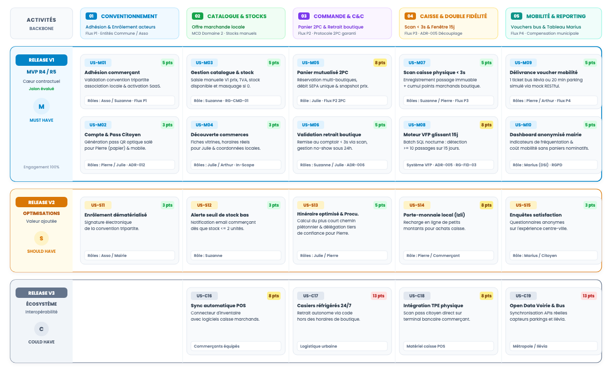

## 6.1. Démarche Agile & Grille de Story Mapping (Méthode Jeff Patton)

L'ingénierie des exigences de ShopLoc applique la démarche de **User Story Mapping** formalisée par Jeff Patton. Cette approche organise l'espace fonctionnel selon deux dimensions complémentaires qui réconcilient le parcours usager continu et la livraison logicielle incrémentale :
* **Axe horizontal (La colonne vertébrale / Backbone)** : Déroule la chronologie narrative des activités métiers clés déduites des personas (Section 02) et des flux BPMN (Section 03) : conventionnement territorial, gestion du catalogue, commande Click &amp; Collect 2PC, enregistrement caisse et mobilité municipale.
* **Axe vertical (Les tranches de release)** : Hiérarchise la profondeur fonctionnelle en isolant le cœur contractuel de la première livraison (**Release V1 — MVP**) des optimisations ultérieures (**Release V2**) et des interconnexions d'écosystème (**Release V3**).

<div class="diagram-container" style="margin: 2pt 0;">
  
  <div class="diagram-caption">Figure 6.1 — Grille Visuelle de User Story Mapping (Méthode Jeff Patton) &amp; Découpage par Releases</div>
</div>

### Principes Directeurs du Slicing &amp; Trajectoire de Release
* **Vertical Slicing de bout en bout (V1 MVP)** : Chaque tranche traverse les 5 activités du backbone. Dès la V1, un usager peut s'inscrire, commander en ligne, retirer ses achats, cumuler des points et débloquer son titre de mobilité.
* **Engagement contractuel ferme (Jalons R4/R5)** : La tranche V1 regroupe strictement les exigences *Must Have*. Cet ensemble constitue le périmètre d'évaluation opérationnelle des démonstrateurs R4 et R5.

<div style="page-break-before: always;"></div>

## 6.2. Backlog Priorisé MoSCoW — Domaines Onboarding &amp; Catalogue Marchand

La priorisation du backlog applique la méthode formelle **MoSCoW**, alignée sur les engagements contractuels du projet : **Must Have** (indispensable au MVP V1), **Should Have** (valeur ajoutée planifiée en V2), **Could Have** (opportunités V3) et **Won't Have** (hors périmètre R1-R5). Les estimations sont chiffrées en points de complexité relative (suite de Fibonacci).

| Réf. | Épique / Intitulé de la User Story | Acteur Cible | Priorité MoSCoW | Effort | Dépendance Métier &amp; Traçabilité |
|---|---|---|---|---|---|
| **US-M01** | Conventionnement municipal &amp; adhésion commerçante | Association / Suzanne | **Must Have (V1)** | 5 pts (M) | BPMN P1 · Entités COMMUNE, ASSOCIATION, COMMERCANT |
| **US-M02** | Compte citoyen &amp; génération pass optique bi-média | Pierre / Julie | **Must Have (V1)** | 3 pts (S) | Entité CITOYEN (`hash_pass_optique`) · ADR-012 |
| **US-M03** | Gestion catalogue marchand &amp; stocks manuels V1 | Suzanne | **Must Have (V1)** | 5 pts (M) | Entité ARTICLE (`stock_disponible`) · RG-CMD-01 |
| **US-M04** | Découverte commerces de proximité &amp; vitrines | Julie / Arthur | **Must Have (V1)** | 3 pts (S) | Horaires réels, fiches vitrines &amp; catalogue public |
| **US-M05** | Panier mutualisé multi-boutiques &amp; protocole 2PC | Julie / Arthur | **Must Have (V1)** | 8 pts (L) | BPMN P2 · Entités COMMANDE, LIGNE_COMMANDE |
| **US-M06** | Retrait comptoir express (&lt; 3s) &amp; gestion No-Show | Suzanne / Julie | **Must Have (V1)** | 5 pts (M) | BPMN P2, P5 · Snapshot tarifaire · ADR-006 |
| **US-S11** | Enrôlement dématérialisé &amp; signature tripartite | Association / Mairie | **Should Have (V2)**| 3 pts (S) | Dématérialisation convention municipale |
| **US-S12** | Alerte proactive franchissement seuil stock bas | Suzanne | **Should Have (V2)**| 3 pts (S) | Notification email si `stock_disponible <= 2` |

### Caractérisation des Règles de Gestion de Priorisation (Format Analyste)
* **RG-BCK-01 : Primauté du stock manuel en phase de lancement (V1 — Suzanne)**  
  *Énoncé :* Les commerçants gèrent leurs stocks directement via l'interface web ShopLoc sans interfaçage logiciel tiers.  
  *Explication :* Évite d'imposer un investissement matériel lourd aux commerçants lors du pilote initial. Le système masque automatiquement tout article dont le stock est épuisé afin de sécuriser les réservations.
* **RG-BCK-02 : Sanctuarisation du pass citoyen universel bi-média (V1 — Pierre &amp; Julie)**  
  *Énoncé :* L'identifiant citoyen fonctionne indifféremment sur écran de smartphone ou sur carte papier imprimée.  
  *Explication :* Garantit l'inclusion des personnes âgées (Pierre 74 ans). Le pass physique intègre un QR code encodant l'empreinte hachée SHA-256 salée de l'usager, scannable instantanément et conforme au RGPD.
* **RG-BCK-03 : Éligibilité sous convention tripartite (V1 — Association locale)**  
  *Énoncé :* Aucun marchand ne peut publier d'offres sans validation formelle préalable de l'association commerçante.  
  *Explication :* L'association certifie l'implantation physique en centre-ville, préservant la souveraineté locale et le modèle à 0% de commission sur les ventes des commerçants partenaires (ADR-004).

<div style="page-break-before: always;"></div>

## 6.3. Backlog Priorisé MoSCoW — Domaines Caisse, Fidélité, Mobilité &amp; Exclusions

Ce domaine constitue le cœur transactionnel et civique de ShopLoc, reliant le passage en caisse physique, le double moteur de fidélité découplé (ADR-005) et les compensations de mobilité urbaine.

| Réf. | Épique / Intitulé de la User Story | Acteur Cible | Priorité MoSCoW | Effort | Dépendance Métier &amp; Traçabilité |
|---|---|---|---|---|---|
| **US-M07** | Scan express passage en caisse physique (&lt; 3s) &amp; points | Suzanne / Pierre | **Must Have (V1)** | 5 pts (M) | BPMN P3 · PASSAGE_CAISSE, COMPTE_FIDELITE |
| **US-M08** | Moteur batch nocturne VFP fenêtre glissante 15 jours | Pierre (Citoyen) | **Must Have (V1)** | 8 pts (L) | Algorithme SQL glissant · ADR-005 · RG-FID-03 |
| **US-M09** | Délivrance voucher mobilité douce (bus / parking) | Pierre / Arthur | **Must Have (V1)** | 5 pts (M) | BPMN P4 · Entité AVANTAGE_MOBILITE · Mocks REST |
| **US-M10** | Dashboard communal d'impact et de coûts anonymisé | Marius (DSI Mairie)| **Must Have (V1)** | 5 pts (M) | Pseudonymisation RGPD · Partition INSEE |
| **US-S13** | Tournée piétonne optimisée &amp; mandat tiers de confiance | Julie / Pierre | **Should Have (V2)**| 5 pts (M) | Calcul plus court chemin (TSP) &amp; procuration |
| **US-S14** | Porte-monnaie virtuel rechargeable pour micro-achats (Izli)| Pierre / Marchand | **Should Have (V2)**| 8 pts (L) | Chargement CB en ligne pour paiement caisse |
| **US-C16** | Synchronisation automatisée des inventaires POS caisse | Commerçants | **Could Have (V3)** | 8 pts (L) | Connecteur logiciel direct ERP marchand |
| **US-C17** | Casiers consignes réfrigérés de retrait autonome 24/7 | Julie (Actifs) | **Could Have (V3)** | 13 pts (XL)| Consignes urbaines mutualisées hors boutique |
| **US-C18** | Intégration du scan pass citoyen sur terminal TPE bancaire | Commerçants caisse | **Could Have (V3)** | 8 pts (L) | Application logicielle certifiée sur TPE caisse |
| **US-C19** | Synchronisation temps réel capteurs voirie &amp; bus Ilévia | Marius / Usagers | **Could Have (V3)** | 13 pts (XL)| APIs partenaires mobilité urbaine métropolitaine |

### Exclusions Fermes du Périmètre Projet (Catégorie Won't Have — R1 à R5)
* **W-01 : Livraison motorisée à domicile** : Exclue par la MOA. Contraire à la finalité civique qui vise à réactiver les flux piétons et la vie physique de quartier.
* **W-02 : Encaissement d'espèces dans l'application web** : Les flux financiers en ligne sont opérés par carte ou SEPA pour garantir la traçabilité comptable.
* **W-03 : Marketplace généraliste ouverte aux franchises périphériques** : Seuls les artisans et indépendants conventionnés du centre-ville sont éligibles.

<div style="page-break-before: always;"></div>

## 6.4. Spécifications Formelles des User Stories Clés (INVEST &amp; Gherkin — Partie 1)

Les récits majeurs répondent aux critères de qualité **INVEST** (Indépendante, Négociable, Valeur métier, Estimable, Suffisamment petite, Testable). Leurs critères d'acceptation sont formalisés en syntaxe **Gherkin**.

### Fiche US-M05 : Panier Click &amp; Collect Mutualisé &amp; Consensus Two-Phase Commit (2PC)
* **Acteur principal :** Julie &amp; Arthur (Consommateurs actifs) · **Priorité :** Must Have · **Effort :** 8 points Fibonacci (L).
* **Objectif métier :** Composer une commande unique regroupant des articles de plusieurs commerçants et régler en un paiement bancaire unique.
* **Bénéfice :** Gain de temps substantiel, mutualisation des achats de proximité et garantie de réservation simultanée de stock.

```gherkin
Scénario: Réservation nominale d'un panier multi-boutiques sous protocole 2PC
  Étant donné que Julie valide un panier contenant des articles chez "Le Fournil" et "Boucherie Flamande"
  Quand le système amorce la Phase 1 du protocole 2PC en verrouillant les stocks respectifs
  Alors le système confirme la disponibilité chez l'ensemble des commerçants partenaires
  Et le système débite la carte bancaire de Julie du montant global exact
  Et le système exécute la Phase 2 en émettant un bon de retrait unique et en notifiant les marchands.

Scénario: Rupture concurrente de stock chez un commerçant (Rollback partiel 2PC)
  Étant donné que Julie valide son panier multi-commerces
  Quand la Phase 1 du protocole 2PC constate une rupture d'inventaire chez "Le Fournil"
  Alors le système libère immédiatement les verrous chez les autres marchands sans débiter Julie
  Et le système invite Julie à ajuster sa sélection sans perdre le reste de son panier.
```

### Fiche US-M07 : Enregistrement de Passage Express en Caisse Physique &amp; Double Cumul
* **Acteurs principaux :** Suzanne (Commerçante) et Pierre (Citoyen aîné) · **Priorité :** Must Have · **Effort :** 5 points (M).
* **Objectif métier :** Scanner le pass optique en caisse en moins de 3 secondes pour horodater la visite et créditer les points marchands.
* **Bénéfice :** Encaissement fluide sans friction technologique pour les seniors et alimentation automatique du moteur VFP.

```gherkin
Scénario: Enregistrement nominal d'un passage en boutique avec scan express (< 3s)
  Étant donné que Pierre présente son pass papier QR à la caisse de Suzanne
  Quand Suzanne scanne le pass optique via la webcam ou la douchette de son poste
  Alors le système authentifie l'empreinte SHA-256 salée sans exposer les données nominatives
  Et le système consigne un enregistrement immuable dans PASSAGE_CAISSE horodaté à la seconde
  Et le système crédite les points boutique dans COMPTE_FIDELITE_MARCHAND selon le barème de Suzanne.

Scénario: Présentation d'un support optique papier dégradé ou froissé
  Étant donné que le pass imprimé de Pierre ne peut être décodé optiquement après 2 secondes
  Quand Suzanne saisit manuellement le pseudonyme d'audit à 6 caractères lisible sur la carte
  Alors le système valide le passage en consignant le mode manuel pour la traçabilité de l'audit.
```

<div style="page-break-before: always;"></div>

## 6.5. Spécifications Formelles (Partie 2) &amp; Matrice de Traçabilité Exigences

### Fiche US-M08 : Calcul Batch Nocturne VFP sur Fenêtre Glissante de 15 Jours
* **Acteurs :** Système Core &amp; Pierre · **Priorité :** Must Have · **Effort :** 8 pts (L) · **Règle :** >= 10 passages sur 15 jours glissants (ADR-005).

```gherkin
Scénario: Évaluation nocturne de la régularité citoyenne VFP
  Étant donné que le batch SQL nocturne s'exécute à minuit pour évaluer les passages de Pierre entre J-14 et J
  Quand le système dénombre 10 passages distincts enregistrés dans PASSAGE_CAISSE
  Alors le système active le statut VFP pour 24h et génère le voucher AVANTAGE_MOBILITE
  Mais si le total est inférieur à 10, le profil reste standard sans perte des points boutiques.
```

### Fiche US-M10 : Tableau de Bord Communal d'Impact Territorial &amp; Pseudonymisation
* **Acteur :** Marius (DSI Mairie) · **Priorité :** Must Have · **Effort :** 5 pts (M) · **Règle :** Agrégats territoriaux stricts (Privacy by Design).

```gherkin
Scénario: Consultation des indicateurs d'impact territorial par la collectivité
  Étant donné que Marius s'authentifie sur l'espace d'administration avec son rôle DSI Collectivité
  Quand Marius consulte le tableau de bord mensuel de fréquentation commerciale de sa commune
  Alors le système affiche le volume global de passages, les usagers VFP et le coût mobilité compensé
  Et le système garantit qu'aucune donnée nominative ni panier d'achat individuel n'est accessible.
```

### Matrice de Traçabilité Fonctionnelle de Bout en Bout
La matrice atteste de la couverture exhaustive des besoins APTE (Sec. 01), des flux BPMN (Sec. 03) et des entités MCD (Sec. 04) par le backlog (Sec. 06).

| Exigence Canonique APTE (Sec. 01) | Processus Métier BPMN (Sec. 03) | Entités Conceptuelles MCD (Sec. 04) | User Stories Couvrantes (Sec. 06) | Priorité &amp; Jalon Cible |
|---|---|---|---|---|
| **FP1 : Revitalisation commerciale** | P1 Adhésion &amp; P2 C&amp;C | `COMMERCE`, `ARTICLE`, `COMMANDE` | **US-M01**, **US-M03**, **US-M05** | Must Have · Release V1 (R4/R5) |
| **FP2 : Panier d'achats pédestre C&amp;C** | P2 Commande &amp; Retrait | `ARTICLE`, `LIGNE_COMMANDE` | **US-M04**, **US-M05**, **US-M06**, **US-S13** | Must Have (V1) / Should Have (V2) |
| **FP3 : Double fidélité VFP &amp; Mobilité**| P3 Caisse &amp; P4 Mobilité | `PASSAGE_CAISSE`, `AVANTAGE_MOBILITE` | **US-M07**, **US-M08**, **US-M09** | Must Have · Release V1 (R4/R5) |
| **FC1 : Souveraineté &amp; Multi-Tenancy** | P1 Conventionnement | `COMMUNE`, `ASSOCIATION` | **US-M01**, **US-M10**, **US-C19** | Must Have (V1) / Could Have (V3) |
| **FC2 : Pseudonymisation &amp; RGPD** | P3 Caisse &amp; Reporting | `CITOYEN` (`hash_pass_optique`) | **US-M02**, **US-M07**, **US-M10** | Must Have · Release V1 (R4/R5) |
| **FC3 : Accessibilité &amp; Seniors** | P2 Retrait &amp; P3 Caisse | `CITOYEN`, `PASSAGE_CAISSE` | **US-M02**, **US-M06**, **US-S13** | Must Have (V1) / Should Have (V2) |
