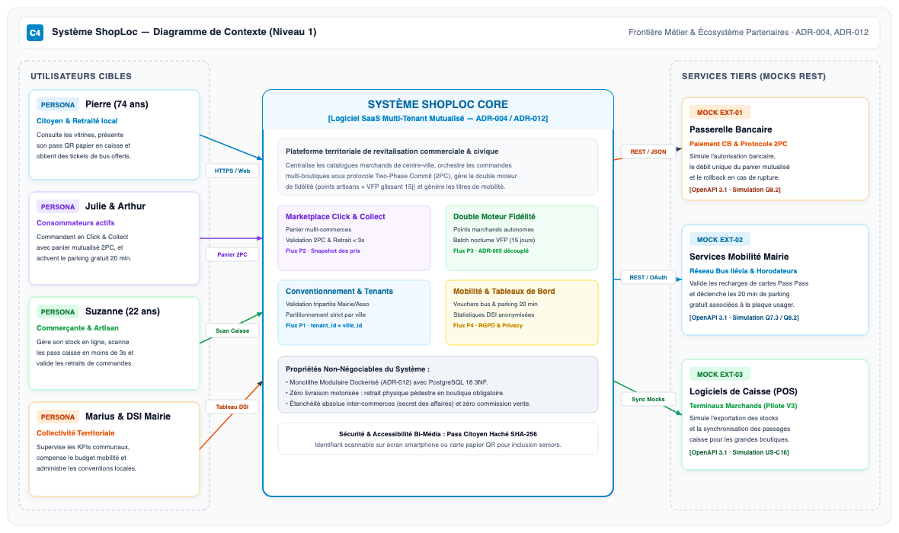
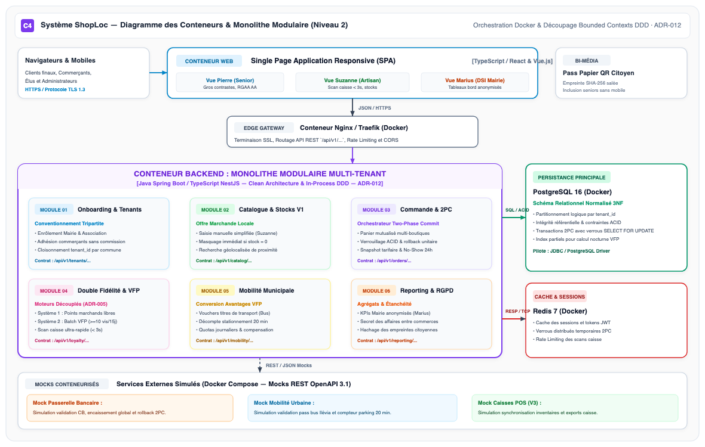

## 7.1. Vision d'Architecture Globale &amp; Diagramme C4 Niveau 1 (Contexte Système)

Le dimensionnement architectural de ShopLoc répond à une exigence centrale : concilier la souveraineté territoriale des collectivités locales, l'indépendance commerciale des artisans et la frugalité opérationnelle d'un éditeur logiciel SaaS. Le cadrage applique le modèle **C4 (Context, Containers, Components, Code)** formalisé par Simon Brown. Le premier niveau (Contexte Système) isole les frontières du système et caractérise ses interactions avec les personas cibles et les services externes partenaires.

<div class="diagram-container" style="margin: 2pt 0;">
  
  <div class="diagram-caption">Figure 7.1 — Diagramme C4 Niveau 1 : Contexte Système ShopLoc &amp; Écosystème Partenaires (ADR-004, ADR-012)</div>
</div>

### Principes Directeurs &amp; Frontières du Système
* **Architecture SaaS Multi-Tenant Mutualisée (ADR-004 &amp; ADR-012)** : Une infrastructure logicielle unique héberge l'ensemble des collectivités partenaires. L'étanchéité des données et des budgets municipaux est garantie par un partitionnement logique strict (`tenant_id = ville_id`). Aucun pont ni cumul de points n'est autorisé entre deux villes distinctes.
* **Frontière Pédestre Stricte &amp; Zéro Livraison Motorisée** : Conformément aux arbitrages MOA, ShopLoc exclut toute logistique de livraison à domicile. Le système canalise les flux physiques vers les boutiques de centre-ville via le Click &amp; Collect et le passage en caisse.
* **Intégration des Services Tiers par Mocks REST (Q8.2)** : Les trois systèmes externes indispensables (Passerelle Bancaire pour le débit 2PC, SI Mobilité pour les titres de bus/parking, et Terminaux POS caisse) sont interfacés via des simulateurs REST normalisés sous spécification OpenAPI 3.1.

<div style="page-break-before: always;"></div>

## 7.2. Architecture des Conteneurs &amp; Diagramme C4 Niveau 2 (Monolithe Modulaire Docker)

Le second niveau d'abstraction C4 détaille les conteneurs exécutables déployés au sein de l'environnement conteneurisé Docker. Afin de concilier simplicité de déploiement et robustesse transactionnelle, l'architecture retient un **Monolithe Modulaire Multi-Tenant** articulé autour de six contextes délimités (**Bounded Contexts DDD**).

<div class="diagram-container" style="margin: 2pt 0;">
  
  <div class="diagram-caption">Figure 7.2 — Diagramme C4 Niveau 2 : Conteneurs &amp; Monolithe Modulaire Docker (6 Bounded Contexts DDD · ADR-012)</div>
</div>

### Découpage en Bounded Contexts DDD &amp; Justification Architecturale
* **Découpage Modulaire Interne (Clean Architecture)** :
  1. *Onboarding &amp; Tenants* : Enrôlement tripartite Mairie / Association / Artisans et gestion du `tenant_id`.
  2. *Catalogue &amp; Stocks V1* : Gestion des vitrines marchandes et mise à jour manuelle des stocks (Suzanne).
  3. *Commande &amp; 2PC* : Panier multi-boutiques mutualisé sous protocole Two-Phase Commit transactionnel.
  4. *Double Fidélité &amp; VFP* : Points marchands autonomes et moteur batch SQL nocturne sur 15 jours glissants (ADR-005).
  5. *Mobilité Municipale* : Émission et validation des vouchers mobilité douce (Pass Pass bus &amp; stationnement 20 min).
  6. *Reporting &amp; Audit RGPD* : Tableaux de bord municipaux anonymisés (Marius) et secret des affaires inter-commerces.
* **Justification Monolithe Modulaire vs Microservices Purs (ADR-012)** :  
  *Énoncé :* L'adoption d'un monolithe modulaire élimine la sur-ingénierie et garantit des performances maximales.  
  *Explication :* Les microservices distribués introduiraient une latence réseau prohibitive sur l'orchestration 2PC, des coûts d'infrastructure démesurés pour les petites communes (&lt; 20k hab.) et des risques d'incohérence transactionnelle. Les appels intra-modules s'exécutent en mémoire (*in-process*) avec transactions ACID locales sous PostgreSQL 16.

<div style="page-break-before: always;"></div>

## 7.3. Contrats d'Interface REST &amp; Spécifications OpenAPI 3.1

L'ensemble des échanges entre le frontend web, le monolithe modulaire et les simulateurs tiers est standardisé selon la spécification **OpenAPI 3.1**. Les endpoints intègrent systématiquement le préfixe multi-tenant `/api/v1/tenants/{tenant_id}`, assurant l'étanchéité des requêtes au niveau applicatif.

| Route d'API REST (v1) | Méthode | Payloads &amp; Paramètres Clés | Codes HTTP | Sécurité &amp; RBAC | Traçabilité Métier &amp; US |
|---|---|---|---|---|---|
| `/api/v1/tenants/{tenant_id}/merchants/enroll` | `POST` | Dossier SIRET, RIB, convention tripartite | `201`, `400`, `409` | Admin Association / Mairie | Flux P1 · US-M01 |
| `/api/v1/tenants/{tenant_id}/catalog/articles` | `GET` | Filtres: `categorie`, `commercant_id`, `dispo` | `200`, `400` | Public / Citoyen | Vitrines · US-M04 |
| `/api/v1/tenants/{tenant_id}/orders` | `POST` | Items multi-boutiques, token paiement CB | `201`, `400`, `409` | Citoyen authentifié (JWT) | Flux P2 (2PC) · US-M05 |
| `/api/v1/tenants/{tenant_id}/orders/{id}/pickup` | `POST` | Code retrait, signature horodatée | `200`, `404`, `410` | Commerçant boutique | Retrait express · US-M06 |
| `/api/v1/tenants/{tenant_id}/pos/checkin` | `POST` | `hash_pass_optique`, montant transaction | `200`, `400`, `404` | Commerçant (Scan &lt; 3s) | Flux P3 · US-M07 |
| `/api/v1/tenants/{tenant_id}/vfp/batch-evaluation` | `POST` | Déclencheur cron nocturne J-14 à J | `200`, `500` | Système interne (Cron) | Moteur VFP · US-M08 |
| `/api/v1/tenants/{tenant_id}/mobility/vouchers` | `POST` | Type titre (`bus`, `parking`), plaque / id | `201`, `403`, `429` | Citoyen statut VFP actif | Flux P4 · US-M09 |
| `/api/v1/tenants/{tenant_id}/admin/kpis` | `GET` | Période `start_date`, `end_date`, maille INSEE | `200`, `401`, `403` | DSI Collectivité (Marius) | Dashboard · US-M10 |

### Stratégie Formelle des Mocks REST pour Systèmes Partenaires (Q8.2)
* **Mock 1 : Passerelle Monétique Bancaire (`/mock/bank/v1/charge`)**  
  *Rôle :* Simule la pré-autorisation, le débit unique du montant global du panier mutualisé et le rollback unitaire si un sous-commerçant subit une rupture de stock concurrente. Retourne `200 OK` avec un token d'acquittement ou `402 Payment Required`.
* **Mock 2 : Opérateur Mobilité Urbaine (`/mock/mobility/v1/validate-voucher`)**  
  *Rôle :* Simule le crédit direct d'un titre de transport sur carte Pass Pass Ilévia ou l'activation d'un forfait de stationnement voirie de 20 minutes gratuites rattaché à l'immatriculation du citoyen VFP.
* **Mock 3 : Logiciel POS Caisse Marchand (`/mock/pos/v1/inventory-sync`)**  
  *Rôle :* Prévu pour les évolutions V3, simule la synchronisation bidirectionnelle de l'état des stocks sans saisie manuelle.

<div style="page-break-before: always;"></div>

## 7.4. Exigences Non-Fonctionnelles (NFR), Sécurité RBAC &amp; Traçabilité RGPD

L'architecture logicielle satisfait un ensemble d'exigences non-fonctionnelles critiques garantissant la pérennité de l'exploitation, la sobriété énergétique et la conformité légale au RGPD.

| Catégorie NFR | Métrique / Cible Contractuelle | Justification d'Ingénierie &amp; Dispositif Technique |
|---|---|---|
| **Performance Caisse** | Temps de scan &amp; réponse &lt; 3,0 s | Requête unitaire indexée sur `hash_pass_optique`, cache Redis sur les commerçants actifs. |
| **Performance Web** | Temps de réponse API &lt; 500 ms (p95) | Index B-Tree composites sous PostgreSQL 16, pagination systématique (`limit`/`offset`). |
| **Disponibilité Système** | SLA global &gt;= 99,8% en heures ouvrées | Déploiement conteneurisé Docker, healthchecks automatisés et redémarrage automatique. |
| **Scalabilité Multi-Villes** | Communes de 5k à &gt; 100k habitants | Partitionnement logique `tenant_id`, requêtes sans jointure croisée entre collectivités. |
| **Éco-Conception Green IT** | Payloads JSON sobres &amp; compression gzip | Limitation des champs retournés (DTO dédiés), mise en cache HTTP et assets web minifiés. |

### Matrice de Contrôle d'Accès Basé sur les Rôles (RBAC) &amp; Sessions Sécurisées
* **Rôle Citoyen / Consommateur (`ROLE_CITIZEN`)** : Accès au catalogue public, gestion de son profil, pass bi-média, commande C&amp;C et déblocage de ses vouchers mobilité personnels.
* **Rôle Artisan / Commerçant (`ROLE_MERCHANT`)** : Gestion exclusive de sa boutique, saisie de ses stocks, validation des retraits et scan express caisse. *Secret des affaires : étanchéité absolue interdisant l'accès aux ventes du voisin.*
* **Rôle Collectivité / DSI Mairie (`ROLE_CITY_ADMIN`)** : Consultation des indicateurs macroscopiques agrégés et validation des conventions. *Interdiction stricte d'accès aux paniers individuels nominatifs.*
* **Rôle Super-Administrateur SaaS (`ROLE_SUPER_ADMIN`)** : Provisionnement de nouveaux tenants municipaux et supervision système.

### Dispositif Privacy by Design &amp; Pseudonymisation RGPD (ADR-008)
* **Sanctuarisation de l'Identité Citoyenne** : Le pass optique bi-média n'embarque aucun identifiant en clair. Il encode l'empreinte hachée salée `SHA-256(citoyen_id + sel_commune)`. Suzanne enregistre le passage sans jamais accéder au nom ni à l'adresse de Pierre.
* **Agrégation Territoriale Anonymisée** : Les requêtes du tableau de bord de Marius exécutent des fonctions d'agrégation SQL (`COUNT`, `AVG`) avec k-anonymat naturel empêchant toute ré-identification unitaire.

<div style="page-break-before: always;"></div>

## 7.5. Stratégie de Déploiement Conteneurisé, Profils &amp; Trajectoire DevOps

Pour garantir la reproductibilité intégrale de l'environnement d'évaluation par le jury universitaire, ShopLoc adopte une stratégie de conteneurisation intégrale orchestrée par **Docker Compose**. Cette démarche assure une étanchéité absolue avec le code source hébergé sur GitLab Univ-Lille.

```text
ShopLoc Infrastructure Stack (docker-compose.yml)
├── nginx-gateway         : Reverse Proxy, terminaison TLS, port 80/443 -> routage interne
├── shoploc-backend       : Monolithe Modulaire (Spring Boot / NestJS, port interne 8080)
├── shoploc-frontend      : Single Page Application responsive (Nginx statique, port 80)
├── postgres-db           : PostgreSQL 16 relationnel (volume persistant pgdata, port 5432)
├── redis-cache           : Redis 7 en mémoire (cache sessions & verrous 2PC, port 6379)
└── mock-partners         : Simulateurs REST OpenAPI (Banque, Mobilité PassPass, POS)
```

### Profils d'Exécution &amp; Environnements Homogènes
* **Profil Local / Développement (`profile: dev`)** : Exécution sur machine étudiante avec rechargement à chaud (*hot-reload*), base PostgreSQL initialisée avec jeu d'essai territorial (Lille centre-ville) et mocks activés localement.
* **Profil Test &amp; CI/CD (`profile: test`)** : Exécution automatisée dans le runner GitLab CI pour les tests unitaires et les scénarios d'intégration TDD (Gherkin / Cucumber) sur les flux critiques 2PC et VFP.
* **Profil Démonstrateur Évalué (`profile: demo-eval`)** : Configuration cible pour les soutenances R4 et R5, instanciant la pile complète en une unique commande `docker compose up -d` sans dépendance cloud externe.

### Matrice de Traçabilité Architecture &amp; Backlog V1 (DoD Technique)
L'architecture technique supporte l'intégralité des dix User Stories prioritaires (*Must Have*) du MVP V1 :
* **US-M01 &amp; US-M02** : Prises en charge par le *Module Onboarding*, le hachage SHA-256 du pass et le schéma relationnel PostgreSQL.
* **US-M03 &amp; US-M04** : Hébergées sur le *Module Catalogue*, servies sous cache Redis et index PostgreSQL composites.
* **US-M05 &amp; US-M06** : Orchestrées par le *Module Commande* sous transactions ACID locales et simulation bancaire mockée.
* **US-M07, US-M08 &amp; US-M09** : Traitées par le *Module Double Fidélité*, le batch nocturne glissant et le mock mobilité PassPass.
* **US-M10** : Desservie par le *Module Reporting*, garantissant la pseudonymisation stricte et la conformité RGPD.
