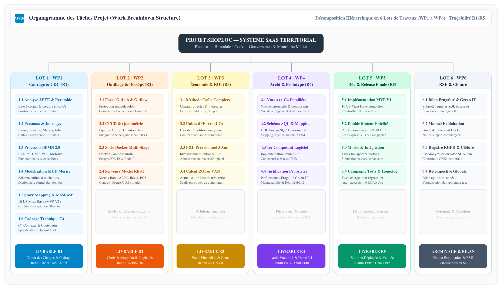
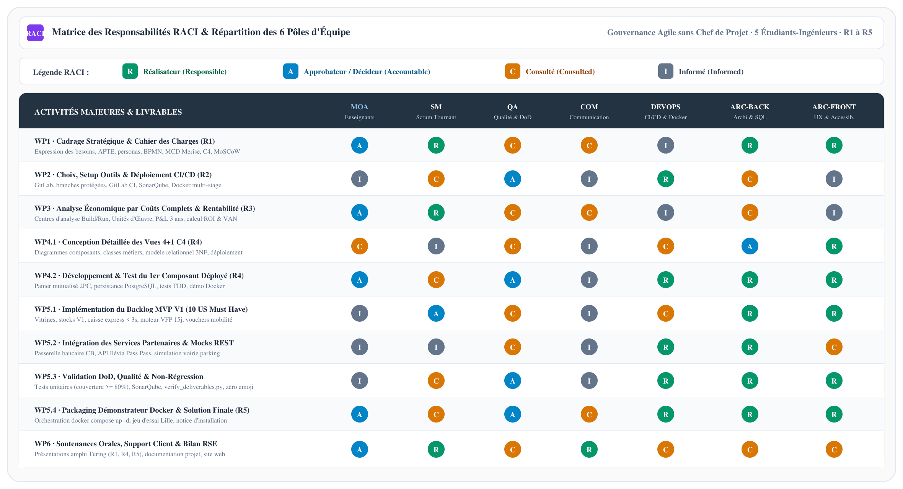
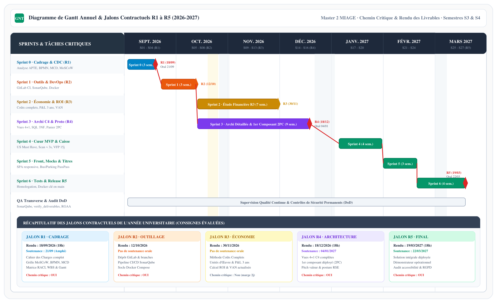

## 8.1. Cadre Méthodologique Agile Scrum, Rôles d'Équipe &amp; Scrum Master Tournant

La conduite du projet ShopLoc repose sur une transposition rigoureuse du cadre méthodologique **Agile Scrum**, adapté aux standards industriels et aux exigences spécifiques de l'UE Génie Logiciel par la Pratique (GLOP). L'organisation bannit expressément la figure du chef de projet unique et vertical au profit d'une gouvernance responsabilisante articulée autour d'un **Scrum Master tournant** et de pôles de responsabilités spécialisés.

### Principe Directeur : Le Scrum Master Tournant (Règle GLOP)
Conformément aux règles fondamentales d'ingénierie du projet, le rôle de Scrum Master n'est pas figé. Il alterne entre les cinq membres de l'équipe à chaque cycle majeur (sprint contractuel aligné sur les jalons R1 à R5). Cette rotation garantit une triple exigence :
* **Polyvalence managériale &amp; vision globale** : Chaque collaborateur éprouve l'ensemble des facettes de la gestion opérationnelle (animation des rituels, élimination des obstacles, suivi de vélocité, coordination avec la MOA).
* **Équilibre d'implication &amp; équité académique** : La rotation élimine tout phénomène de surcharge asymétrique ou de désengagement. L'historique des commits sur la forge GitLab et les procès-verbaux de réunion reflètent une contribution harmonieuse de l'ensemble du collectif.
* **Auto-organisation &amp; maturité collective** : L'équipe ne dépend d'aucun leader central pour fonctionner ; les arbitrages techniques et fonctionnels sont débattus collégialement en s'appuyant sur les définitions formelles de maturité (DoR et DoD).

### Répartition des 6 Pôles de Responsabilités sur les 5 Membres
Afin de couvrir l'intégralité du cycle de vie du logiciel sans démultiplier la structure, six pôles de responsabilités permanents sont distribués sur les cinq étudiants-ingénieurs, avec un binômage d'expertise sur le développement applicatif :
1. **Responsable Qualité (QA) &amp; Assurance DoD** : Maître d'œuvre de la qualimétrie logicielle. Il valide l'application stricte de la *Definition of Done*, supervise la couverture de tests unitaires et d'intégration (&gt;= 80%), audite les métriques SonarQube et garantit la conformité des livrables documentaires.
2. **Responsable Communication &amp; Relations MOA** : Gestionnaire de l'interface contractuelle avec les enseignants-clients (Laurence Duchien, Anne Etien, François Secchi, Jérémy Woirhaye). Il administre le site cockpit de suivi de projet, diffuse les ordres du jour et consigne les comptes-rendus de séances.
3. **Responsable Déploiement, DevOps &amp; CI/CD** : Concepteur de l'infrastructure de livraison continue. Il orchestre les pipelines GitLab CI/CD, optimise les images Docker multi-stage, garantit la reproductibilité des environnements et rédige les notices d'installation.
4. **Spécialiste Outils &amp; Ingénieur Logiciel** : Pilote de l'environnement de développement et de la chaîne de compilation. Il configure les linters, gère les dépendances, assure le support technique interne et supervise les simulateurs (mocks REST OpenAPI 3.1).
5. **Responsable Architecture Back-Office &amp; Persistance** : Garant de l'intégrité transactionnelle. Il conçoit le schéma PostgreSQL normalisé en 3NF, veille au partitionnement multi-tenant (`tenant_id`), implémente l'orchestration 2PC et sécurise les APIs REST.
6. **Responsable Architecture Front-Office &amp; Accessibilité RGAA** : Concepteur de l'expérience utilisateur. Il veille à l'adéquation des interfaces avec les personas cibles (Pierre senior vs Suzanne commerçante) et certifie la conformité au niveau double A du RGAA / WCAG 2.1.

## 8.2. Organigramme des Tâches (WBS) &amp; Découpage Hiérarchique par Lots

L'ordonnancement opérationnel applique la méthode de l'**Organigramme des Tâches (WBS)**. Ce découpage arborescent décompose la finalité globale du système SaaS territorial en six grands lots de travaux (*Work Packages*) autonomes et étanches, garantissant la traçabilité intégrale entre les exigences du sujet et les livrables contractuels.

  
  
Figure 8.1 — Organigramme des Tâches Projet (WBS par Lots de Travaux) · Traçabilité R1 à R5

### Caractérisation des 6 Lots de Travaux (Work Packages)
* **Lot 1 (WP1) : Cadrage Stratégique &amp; Cahier des Charges (R1)** : Analyse du besoin APTE (FP/FC), personas, BPMN 2.0 (P1-P5), MCD Merise 3NF, backlog MoSCoW, C4 et CDC unifié.
* **Lot 2 (WP2) : Outillage, Qualimétrie &amp; Socle DevOps (R2)** : Dépôt GitLab, branches protégées, pipeline GitLab CI, SonarQube (seuil 80%), Docker Compose et mocks REST OpenAPI 3.1.
* **Lot 3 (WP3) : Modélisation Économique &amp; Rentabilité (R3)** : Méthode des coûts complets, centres d'analyse Build/Run, Unités d'Œuvre, compte de résultat 3 ans, calcul ROI &amp; VAN.
* **Lot 4 (WP4) : Architecture C4, Conception &amp; Prototype V1 (R4)** : Vues 4+1 C4, DDL PostgreSQL 16 3NF, développement vertical du 1er composant déployé (Panier 2PC) sous TDD.
* **Lot 5 (WP5) : Développement Intégral, Intégration &amp; Release Finale (R5)** : 10 US Must Have (MVP V1), moteur VFP 15j glissant, caisse express &lt; 3s, vouchers mobilité, tests charge et release Docker.
* **Lot 6 (WP6) : Conduite du Changement, Éco-Conception &amp; Clôture RSE** : Bilan Green IT, conformité RGPD (secret des affaires), manuels d'exploitation et soutenances d'évaluation.

## 8.3. Matrice des Responsabilités RACI &amp; Définitions de Maturité (DoR / DoD)

La **Matrice RACI** croise les activités majeures du WBS avec les six pôles d'expertise de l'équipe et la Maîtrise d'Ouvrage (MOA), prévenant toute ambiguïté sur l'imputabilité des tâches et le pouvoir décisionnel.

  
  
Figure 8.2 — Matrice des Responsabilités RACI (6 Pôles d'Équipe &amp; MOA) · Gouvernance sans Chef de Projet

### Cadre Opérationnel de Maturité Logicielle : DoR et DoD
Pour garantir l'excellence technique exigée par le référentiel GLOP, deux verrous de contrôle qualité encadrent chaque tranche de développement :

* **Definition of Ready (DoR) — Critères d'Admission en Sprint** :
  1. *Format INVEST* : US indépendante, négociable, testable et estimée &lt;= 8 points.
  2. *Critères Gherkin* : Scénarios nominaux et d'exceptions formalisés (`Étant donné / Quand / Alors`).
  3. *Ergonomie validée* : Zonings certifiés accessibles RGAA AA pour Pierre et Suzanne.
  4. *Contrats d'API REST* : Spécifications OpenAPI 3.1 figées avec payloads JSON et codes HTTP.
  5. *Mocks externes* : Simulateurs partenaires opérationnels sous conteneurs Docker (Banque, Mobilité).

* **Definition of Done (DoD) — Critères de Validation Formelle d'un Incrément** :
  1. *Revue de code par les pairs (*Peer Review*)* : Approbation formelle requise avant fusion sur `develop`.
  2. *Couverture de tests automatisés (&gt;= 80%)* : Tests unitaires et d'intégration validés sous JUnit / Jest.
  3. *Quality Gate SonarQube au vert* : Zéro vulnérabilité critique, respect des seuils de maintenabilité.
  4. *Conteneurisation Docker valide* : Compilation et démarrage sans erreur via `docker compose up -d`.
  5. *Documentation &amp; Intégrité vérifiées* : Validation du pare-feu `verify_deliverables.py` (0 emoji, 0 canari).

## 8.4. Planification Opérationnelle, Diagramme de Gantt &amp; Jalons Contractuels

Le **Diagramme de Gantt** planifie les vagues de fabrication en synchronisant les efforts d'ingénierie avec les cinq jalons contractuels de restitution fixés par la MOA (Septembre 2026 à Mars 2027).

  
  
Figure 8.3 — Diagramme de Gantt Annuel &amp; Jalons Contractuels R1 à R5 (2026-2027) · Chemin Critique

### Tableau Récapitulatif des Jalons Contractuels &amp; Chemin Critique

| Jalon | Date de Rendu | Épreuve / Soutenance | Livrables Exigés par la MOA | Chemin Critique |
|---|---|---|---|---|
| **R1** | 18/09/2026 (18h) | Soutenance 21/09 (Amphi Turing) | Cahier des Charges complet : APTE, BPMN, MCD, C4, MoSCoW, WBS, Gantt | **Chemin Critique** (3 sem.) |
| **R2** | 12/10/2026 | *(Évaluation sur dossier)* | Outillage logiciel : GitLab, GitLab CI, SonarQube, socle Docker multi-stage | **Chemin Critique** (3 sem.) |
| **R3** | 30/11/2026 | *(Évaluation sur dossier)* | Étude financière : coûts complets, Unités d'Œuvre, P&amp;L 3 ans, calcul ROI et VAN | Hors chemin critique (marge 3j) |
| **R4** | 18/12/2026 (18h) | Soutenance 04/01/2027 | Architecture C4 (vues 4+1), DDL 3NF, 1er composant déployé (2PC) &amp; pitch RSE | **Chemin Critique** (9 sem.) |
| **R5** | 19/03/2027 (18h) | Soutenance 22/03/2027 | Solution intégrale déployée, 10 US MVP V1 validées, démonstrateur Docker | **Chemin Critique** (11 sem.) |

* **Chemin Critique (Critical Path)** : Séquence stricte **Sprint 0 (R1) -&gt; Sprint 1 (R2) -&gt; Sprint 3 (R4) -&gt; Sprints 4-5-6 (R5)**. Tout retard sur ces sprints impacte directement la date de livraison finale.
* **Marges de Sécurité (*Buffers*)** : Application systématique d'un **gel de code (*Code Freeze*) 72 heures avant chaque jalon contractuel** afin de sanctuariser la validation Docker et la répétition des oraux.

## 8.5. Registre des Risques Projet, Matrice de Criticité &amp; Plans de Mitigation

La gestion des risques applique une démarche proactive conforme à la norme ISO 31000. Chaque aléa est évalué selon sa probabilité d'occurrence (P : 1-5) et sa gravité (G : 1-5), définissant sa criticité ($C = P \times G$).

### Registre des Risques Majeurs &amp; Stratégies de Mitigation

| Réf. | Nature | Description de l'Aléa | P | G | Crit. | Stratégie de Mitigation &amp; Dispositif d'Ingénierie |
|---|---|---|---|---|---|---|
| **R-01** | Orga. | **Déséquilibre de charge** : Surcharge asymétrique ou investissement inégal pénalisé lors de l'évaluation individuelle. | 3 | 4 | **12** (Maj.) | Scrum Master tournant à chaque jalon. Standup hebdomadaire. Suivi de l'équilibre des commits sur GitLab. |
| **R-02** | Tech. | **Complexité transactionnelle 2PC** : Incohérence de réservation en cas de rupture de stock ou latence réseau. | 3 | 4 | **12** (Maj.) | Transactions ACID locales sous PostgreSQL 16. Mocks bancaires OpenAPI 3.1. Tests d'intégration TDD dès le Sprint 2. |
| **R-03** | Métier | **Résistance au changement (Pierre/Suzanne)** : Illectronisme senior ou friction de temps de passage en caisse commerçante. | 3 | 3 | **9** (Mod.) | Caisse express &lt; 3s. Pass papier universel bi-média QR code sans obligation de posséder un smartphone (ADR-012). |
| **R-04** | Sécurité | **Fuite de données / RGPD** : Profilage nominatif ou transgression du secret des affaires inter-commerces. | 2 | 5 | **10** (Maj.) | Privacy by Design : pseudonymisation salée SHA-256. Cloisonnement strict multi-tenant (`tenant_id`). Données agrégées pour Marius. |
| **R-05** | Calendrier | **Dérive de planning** : Glissement des échéances R4 et R5 lié aux examens universitaires et vacances. | 3 | 4 | **12** (Maj.) | Backlog MoSCoW strict (10 US Must Have sanctuarisées). Code freeze systématique à J-3 avant chaque jalon contractuel. |

### Plan de Continuité d'Activité (PCA) &amp; Arbitrage d'Urgence
* **Protocole d'escalade sous 24h** : Déclenchement d'un point exceptionnel piloté par le Scrum Master en cas de blocage technique ou d'indisponibilité d'un équipier.
* **Levier de dé-scopage MoSCoW** : En cas de dérive calendaire, les récits *Should Have* et *Could Have* sont reportés en phase ultérieure pour sanctuariser le socle *Must Have* (MVP V1).
* **Transparence MOA** : En cas de difficulté majeure, notification formelle et concertée des enseignants de l'UE GLOP sous 48h ouvrées.
