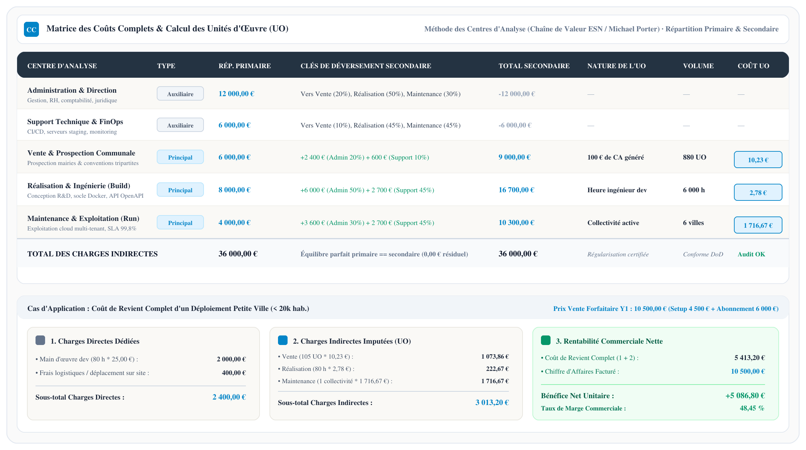
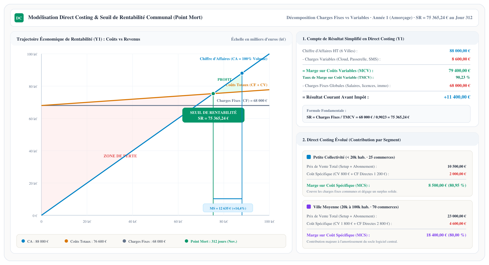
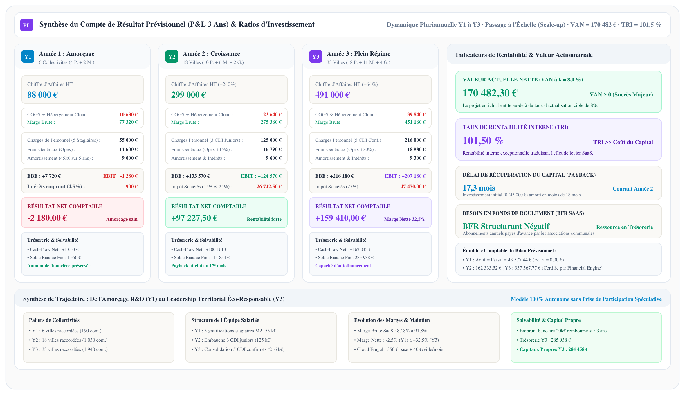

## 9.1. Modèle Économique Contractuel, Gouvernance Tripartite &amp; Gratuité Citoyenne

La viabilité opérationnelle et la pérennité territoriale du dispositif ShopLoc reposent sur un modèle économique contractuel innovant et solidaire, formalisé par une **convention tripartite** liant la municipalité, l'association des commerçants de centre-ville et l'éditeur logiciel ShopLoc (décision d'arbitrage **ADR-004**). Ce montage juridique et financier concilie la sauvegarde du commerce de proximité, la sobriété budgétaire des collectivités et la sanctuarisation du pouvoir d'achat citoyen.

### Architecture Tripartite &amp; Circuit des Flux Financiers
Contrairement aux plateformes prédatrices de livraison rapide, ShopLoc ne se positionne pas comme un intermédiaire commercial privatif mais comme un **opérateur technologique au service du bien commun territorial**. Les relations contractuelles sont structurées selon un circuit vertueux à trois acteurs :
1. **La Municipalité (Mairie)** : Dans le cadre de sa compétence légale de revitalisation des cœurs de ville (programme Action Cœur de Ville / Petites Villes de Demain), la commune vote une **subvention publique d'attractivité** allouée à l'Association des commerçants. Par ailleurs, la Ville finance et compense directement les avantages mobilité offerts aux citoyens les plus réguliers (tickets de transport urbain et franchise de 20 minutes de stationnement en voirie).
2. **L'Association des Commerçants (Structure Loi 1901)** : Tiers de confiance local et co-contractant de référence, l'association reçoit la subvention municipale et souscrit le contrat de service logiciel auprès de ShopLoc. Elle anime le réseau sur le terrain, valide l'adhésion des commerçants partenaires et collecte les cotisations associatives annuelles.
3. **ShopLoc (Éditeur Logiciel SaaS)** : Fournit le socle applicatif conteneurisé, assure le déploiement technique initial (*setup*), l'hébergement mutualisé haute disponibilité (*run*), le support commerçant et les évolutions logicielles contractuelles.

### Principe d'Équité Territoriale : 0% de Commission &amp; Gratuité Citoyenne
Le modèle financier repose sur deux principes fondateurs non-négociables garantissant l'adhésion massive des acteurs locaux :
* **Sanctuarisation des marges marchandes (0% de commission)** : ShopLoc ne prélève **aucun pourcentage sur le chiffre d'affaires** des commerçants. Chaque euro dépensé par un client en Click &amp; Collect ou en caisse physique est intégralement conservé par l'artisan ou le commerçant. Ce positionnement garantit un taux d'adoption maximal auprès des commerçants indépendants (Suzanne), souvent réticents face aux commissions prohibitives des géants de la livraison (15% à 30%).
* **Gratuité citoyenne absolue** : L'accès à la plateforme web responsive, la consultation des catalogues, le passage de commande et le programme de fidélité citoyenne sont entièrement gratuits pour les administrés (Pierre, Julie et Arthur). Aucun abonnement ni frais de service ne sont facturés à l'utilisateur final.

### Grille Tarifaire Forfaitaire Échelonnée par Typologie Communale
La facturation de ShopLoc auprès de l'Association des commerçants s'articule autour d'un **forfait annuel prévisible et maîtrisé**, composé d'un droit d'accès et d'installation initial (*Setup Fee*) amorti en Année 1, et d'une redevance d'abonnement annuelle récurrente (*Run Fee*). La tarification est échelonnée en trois paliers de collectivités représentatifs du tissu urbain national :

| Typologie de Collectivité | Tranche Démographique | Nombre Moyen de Commerces | Forfait d'Installation (*Setup Fee*) | Abonnement Annuel (*Run Fee*) | Investissement Total Y1 | Coût Mutualisé par Commerce / Mois |
|---|---|---|---|---|---|---|
| **Petite Ville** | &lt; 20 000 habitants | ~25 commerces | 4 500,00 € | 6 000,00 € | **10 500,00 €** | 35,00 € / mois |
| **Ville Moyenne** | 20 000 à 100 000 hab. | ~70 commerces | 9 000,00 € | 14 000,00 € | **23 000,00 €** | 27,38 € / mois |
| **Grande Ville** | &gt; 100 000 habitants | ~180 commerces | 18 000,00 € | 28 000,00 € | **46 000,00 €** | 21,30 € / mois |

Ce dimensionnement tarifaire démontre que l'effort financier mutualisé ramené à la maille commerçante reste extrêmement modique (inférieur à 35 € par mois et par commerce pour une petite ville, et descendant à 21 € pour une grande métropole), tout en assurant l'autofinancement intégral de la structure d'ingénierie ShopLoc sans dépendre de financements spéculatifs.

<div style="page-break-before: always;"></div>

## 9.2. Démarche d'Analyse des Coûts Complets &amp; Architecture des Centres d'Analyse

Afin d'établir une tarification rigoureusement justifiable devant les élus municipaux et conforme aux exigences universitaires de l'UE Génie Logiciel par la Pratique (GLOP), ShopLoc met en œuvre la **Méthode des Coûts Complets** par centres d'analyse, telle qu'enseignée dans le cursus de référence de Master 2 MIAGE. Cette méthode permet de ventiler sans arbitraire l'intégralité des charges directes et indirectes de l'entreprise sur chaque prestation communale délivrée.

### Typologie et Traitement des Charges en Ingénierie Logicielle
Dans un modèle d'édition logicielle SaaS, la distinction analytique s'opère rigoureusement entre deux natures de dépenses :
* **Les Charges Directes** : Dépenses qui peuvent être affectées immédiatement, sans ambiguïté et sans calcul intermédiaire, au coût de revient d'une collectivité donnée. Elles regroupent le temps de travail dédié des ingénieurs lors du déploiement sur site (paramétrage initial du `tenant_id`, formation des commerçants, accompagnement au premier panier), les frais kilométriques de déplacement et la fourniture des kits de signalétique physique (vitrophanies, chevalets QR code de comptoir).
* **Les Charges Indirectes** : Dépenses de structure et d'infrastructure mutualisées qui concernent l'entreprise dans sa globalité et ne peuvent être rattachées unitairement à un client sans une clé de répartition rationnelle. Elles comprennent les salaires d'encadrement, l'outillage DevOps (serveurs GitLab CI, SonarQube), l'hébergement cloud socle (Docker / PostgreSQL), les assurances professionnelles et les frais légaux.

### Découpage en Centres d'Analyse (Chaîne de Valeur de Michael Porter)
Conformément à la modélisation des Entreprises de Services du Numérique (ESN) et des éditeurs logiciels, les charges indirectes sont regroupées au sein de **cinq centres d'analyse fonctionnels**, scindés en centres auxiliaires et centres principaux :

```text
                               [ CHARGES INDIRECTES TOTALES (36 000 €) ]
                                                  │
                ┌─────────────────────────────────┴─────────────────────────────────┐
                ▼                                                                   ▼
    [ CENTRES AUXILIAIRES ]                                             [ CENTRES PRINCIPAUX ]
    ├── Administration & Direction (12 000 €)                            ├── Vente & Prospection (6 000 €)
    └── Support Technique & FinOps (6 000 €)                            ├── Réalisation / Build R&D (8 000 €)
                │                                                       └── Maintenance / Run Client (4 000 €)
                └────────────── Déversement Secondaire (Clés %) ────────────────────┘
```

#### Les Deux Centres d'Analyse Auxiliaires
Les centres auxiliaires assurent le support structurel de l'entreprise. Leurs coûts ont vocation à être intégralement déversés (*répartition secondaire*) sur les centres opérationnels principaux :
1. **Centre Administration &amp; Direction Générale (12 000,00 €)** : Couvre la gouvernance de l'équipe, la comptabilité générale, la gestion contractuelle des conventions, le conseil juridique RGPD et le pilotage administratif global.
2. **Centre Support Technique &amp; FinOps (6 000,00 €)** : Couvre le maintien en conditions opérationnelles de la forge logicielle, l'orchestration des simulateurs partenaires (APIs mocks bancaires et voirie), la veille cybersécurité et l'optimisation des coûts d'infrastructure cloud.

#### Les Trois Centres d'Analyse Principaux
Les centres principaux matérialisent le cœur de métier de ShopLoc le long de sa chaîne de valeur logicielle. Ils absorbent les coûts des centres auxiliaires et les imputent aux collectivités clientes via des **Unités d'Œuvre (UO)** spécifiques :
1. **Centre Vente &amp; Prospection Communale (6 000,00 € bruts)** : Activités de prospection auprès des directions du développement économique des mairies, négociation des conventions tripartites et animations des réunions de cadrage associatives.
2. **Centre Réalisation &amp; Développement Logiciel - Build (8 000,00 € bruts)** : Activités d'ingénierie logicielle, conception du schéma relationnel 3NF, implémentation des algorithmes transactionnels Click &amp; Collect (2PC) et développement des interfaces adaptées aux personas.
3. **Centre Maintenance &amp; Exploitation Multi-Tenant - Run (4 000,00 € bruts)** : Exploitation de l'infrastructure cloud en production, monitoring temps réel des conteneurs Docker, sauvegardes chiffrées PostgreSQL et support technique commerçant de second niveau garanti par contrat (SLA 99,8%).

<div style="page-break-before: always;"></div>

## 9.3. Clés de Répartition Primaire, Secondaire &amp; Détermination du Coût de Revient

La formalisation du tableau de répartition des charges indirectes constitue la clé de voûte de la comptabilité analytique. Elle permet de transférer mathématiquement les charges auxiliaires vers les centres principaux et de calculer avec exactitude le coût unitaire de chaque Unité d'Œuvre (UO).

<div class="diagram-container" style="margin: 2pt 0;">
  
  <div class="diagram-caption">Figure 9.1 — Matrice des Coûts Complets &amp; Calcul des Unités d'Œuvre (UO) · Chaîne de Valeur Porter</div>
</div>

### Tableau Matriciel des Répartitions et Coûts des Unités d'Œuvre (Année 1)

| Centre d'Analyse | Nature du Centre | Répartition Primaire | Clés de Déversement Secondaire | Répartition Secondaire | Nature de l'Unité d'Œuvre (UO) | Volume Total d'UO (Y1) | Coût Unitaire de l'UO |
|---|---|---|---|---|---|---|---|
| **Administration** | Auxiliaire | 12 000,00 € | Vers Vente (20%), Build (50%), Run (30%) | -12 000,00 € | *(Centre vidé)* | — | — |
| **Support Technique** | Auxiliaire | 6 000,00 € | Vers Vente (10%), Build (45%), Run (45%) | -6 000,00 € | *(Centre vidé)* | — | — |
| **Vente** | Principal | 6 000,00 € | +2 400 € (Admin) + 600 € (Support) | **9 000,00 €** | Tranche de 100 € de CA | 880 UO | **10,23 €** / UO |
| **Réalisation (Build)** | Principal | 8 000,00 € | +6 000 € (Admin) + 2 700 € (Support) | **16 700,00 €** | Heure ingénieur dev | 6 000 h | **2,78 €** / h |
| **Maintenance (Run)** | Principal | 4 000,00 € | +3 600 € (Admin) + 2 700 € (Support) | **10 300,00 €** | Collectivité raccordée | 6 villes | **1 716,67 €** / ville |
| **Total Indirect** | — | **36 000,00 €** | Balance parfaite (écart résiduel = 0,00 €) | **36 000,00 €** | Traçabilité certifiée | — | — |

### Justification Stratégique des Unités d'Œuvre (UO)
Le choix des Unités d'Œuvre répond scrupuleusement aux critères d'adéquation causale du cours de MIAGE pour éviter tout phénomène de subventionnement croisé :
* **Centre Vente (Tranche de 100 € de CA)** : L'effort de prospection et de négociation contractuelle est directement corrélé à la valeur financière du contrat signé (880 tranches pour 88 000 € de CA en Année 1).
* **Centre Réalisation (Heure d'ingénierie)** : Reflète l'intensité de conception logicielle et de codage requise pour fabriquer les fonctionnalités du backlog (base de 6 000 heures productives annuelles réparties sur l'équipe).
* **Centre Maintenance (Nombre de villes raccordées)** : Dans une architecture multi-tenant partitionnée par base de données, l'effort de monitoring et de maintien en production croît de façon linéaire avec le nombre d'instances communales supervisées (6 villes en Année 1).

### Application au Coût de Revient d'une Petite Ville (&lt; 20 000 hab.)
L'imputation au contrat type d'une Petite Ville (CA facturé en Année 1 : 10 500,00 € comprenant 4 500 € de setup et 6 000 € d'abonnement) s'établit ainsi :
1. **Charges Directes affectées** : 80 heures de paramétrage et formation sur site à 25,00 €/h (2 000,00 €) + frais de mission (400,00 €) = **2 400,00 €**.
2. **Charges Indirectes imputées via les UO** :
   - Quote-part Vente : $(10 500 \text{ €} / 100 \text{ €}) \times 10,227 \text{ €} = \mathbf{1 073,86 \text{ €}}$.
   - Quote-part Réalisation : $80 \text{ h} \times 2,783 \text{ €} = \mathbf{222,67 \text{ €}}$.
   - Quote-part Maintenance : $1 \text{ collectivité} \times 1 716,667 \text{ €} = \mathbf{1 716,67 \text{ €}}$.
   - Total charges indirectes imputées = **3 013,20 €**.
3. **Coût de Revient Complet** : $2 400,00 + 3 013,20 = \mathbf{5 413,20 \text{ €}}$.
4. **Marge Nette Commerciale** : $10 500,00 - 5 413,20 = \mathbf{+5 086,80 \text{ €}}$, soit un **taux de marge commerciale de 48,45%**.

Ce calcul prouve rigoureusement que même sur le plus petit segment de collectivité, le prix de vente fixé couvre l'intégralité des coûts directs et sa quote-part équitable de frais de structure, dégageant une marge bénéficiaire substantielle dès la première année sans créer de distorsion concurrentielle.

<div style="page-break-before: always;"></div>

## 9.4. Modélisation Direct Costing, Seuil de Rentabilité Communal &amp; Point Mort

En complément de la méthode des coûts complets, l'analyse par **coûts partiels (Direct Costing et Direct Costing Évolué)** isole le comportement des charges face aux variations du volume d'activité communal. Elle permet de calculer le seuil critique à partir duquel l'exploitation devient structurellement bénéficiaire.

<div class="diagram-container" style="margin: 2pt 0;">
  
  <div class="diagram-caption">Figure 9.2 — Modélisation Direct Costing &amp; Seuil de Rentabilité Communal · Point Mort Année 1</div>
</div>

### Décomposition des Charges Variables et Charges Fixes (Année 1)
Pour l'exercice d'amorçage (Année 1 avec 6 collectivités raccordées et un Chiffre d'Affaires de 88 000,00 €), les dépenses d'exploitation sont scindées en deux blocs distincts :
* **Charges Variables d'Exploitation (CV = 8 600,00 €)** : Dépenses directement proportionnelles au volume de transactions et de commerçants raccordés. Elles intègrent le dimensionnement élastique des conteneurs applicatifs et bases de données PostgreSQL hébergés sur le cloud (40 €/ville/mois), les passerelles de paiement bancaire simulées et l'envoi de SMS transactionnels pour le retrait des commandes.
* **Charges Fixes de Structure (CF = 68 000,00 €)** : Dépenses incompressibles indépendantes du volume de vente immédiat. Elles comprennent les rémunérations de base de l'équipe (55 000 €), l'hébergement cloud socle minimal (350 €/mois), les licences logicielles, l'assurance responsabilité civile professionnelle et la dotation aux amortissements du matériel informatique (9 000 €/an sur 5 ans).

### Calcul du Seuil de Rentabilité (SR), Marge de Sécurité &amp; Point Mort
Le calcul économique déterministe applique les formules canoniques de contrôle de gestion :
* **Marge sur Coût Variable (MCV)** :  
  $$\text{MCV} = \text{CA} - \text{CV} = 88 000,00 \text{ €} - 8 600,00 \text{ €} = \mathbf{79 400,00 \text{ €}}$$
* **Taux de Marge sur Coût Variable (TMCV)** :  
  $$\text{TMCV} = \frac{\text{MCV}}{\text{CA}} = \frac{79 400,00}{88 000,00} = \mathbf{90,227\%}$$
* **Seuil de Rentabilité en Valeur (SR)** :  
  $$\text{SR} = \frac{\text{Charges Fixes}}{\text{TMCV}} = \frac{68 000,00}{0,90227} = \mathbf{75 365,24 \text{ €}}$$
* **Marge de Sécurité (MS) &amp; Indice de Sécurité (IS)** :  
  $$\text{MS} = \text{CA} - \text{SR} = 88 000,00 - 75 365,24 = \mathbf{12 634,76 \text{ €}} \quad \Longrightarrow \quad \text{IS} = \frac{12 634,76}{88 000,00} = \mathbf{14,36\%}$$
* **Point Mort Temporel (PM en jours)** :  
  $$\text{PM} = \frac{\text{SR}}{\text{CA}} \times 365 = \frac{75 365,24}{88 000,00} \times 365 = \mathbf{312,6 \text{ jours}}$$

Le seuil de rentabilité est donc franchi dès le début du mois de novembre de l'Année 1 (312ᵉ jour). L'entreprise dispose d'une **marge de sécurité de 12 635 €**, lui permettant d'absorber une baisse d'activité de plus de 14% sans jamais basculer en perte d'exploitation.

### Direct Costing Évolué : Marges de Contribution par Segment Communal
En isolant les coûts fixes directs propres à chaque catégorie de ville (temps d'assistance dédié et matériel déployé), le Direct Costing Évolué démontre la forte contribution unitaire de chaque palier à la couverture des frais de siège :
* **Petite Ville (&lt; 20k hab.)** : Prix 10 500 € — Coûts spécifiques 2 000 € (CV 800 € + CF directes 1 200 €) $\rightarrow$ **Marge sur coût spécifique de 8 500,00 € (80,95%)**.
* **Ville Moyenne (20k-100k hab.)** : Prix 23 000 € — Coûts spécifiques 4 600 € (CV 1 800 € + CF directes 2 800 €) $\rightarrow$ **Marge sur coût spécifique de 18 400,00 € (80,00%)**.

Chaque signature communale génère une contribution nette supérieure à 80%, sanctuarisant la rentabilité globale du modèle.

<div style="page-break-before: always;"></div>

## 9.5. Synthèse Prévisionnelle Pluriannuelle (P&amp;L 3 Ans) &amp; Trajectoire Économique

La synthèse financière pluriannuelle projette les comptes de l'entreprise sur ses trois premiers exercices (Y1 à Y3). Élaborée à partir des données scellées du moteur arithmétique déterministe (`financial_engine.py`), elle atteste de la transition maîtrisée d'une phase d'amorçage R&amp;D vers un statut d'éditeur logiciel pérenne et rentable.

<div class="diagram-container" style="margin: 2pt 0;">
  
  <div class="diagram-caption">Figure 9.3 — Synthèse du Compte de Résultat Prévisionnel (P&amp;L 3 Ans) &amp; Ratios d'Investissement</div>
</div>

### Compte de Résultat Prévisionnel Consolidé sur 3 Ans (P&amp;L)

| Postes du Compte de Résultat | Exercice Y1 (Amorçage) | Exercice Y2 (Croissance) | Exercice Y3 (Maturité &amp; Échelle) | Évolution Y3 / Y1 |
|---|---|---|---|---|
| **Collectivités Raccordées** | 6 villes (4 P. + 2 M.) | 18 villes (10 P. + 6 M. + 2 G.) | 33 villes (18 P. + 11 M. + 4 G.) | $\times 5,5$ |
| **Chiffre d'Affaires HT (CA)** | **88 000,00 €** | **299 000,00 €** | **491 000,00 €** | **+458%** |
| - Coût des Ventes &amp; Cloud (COGS) | 10 680,00 € | 23 640,00 € | 39 840,00 € | +273% |
| **Marge Brute d'Exploitation** | **77 320,00 € (87,9%)** | **275 360,00 € (92,1%)** | **451 160,00 € (91,9%)** | **+483%** |
| - Frais Généraux Administratifs (Opex) | 14 600,00 € | 16 790,00 € | 18 980,00 € | +30% |
| - Charges de Personnel Salariées | 55 000,00 € | 125 000,00 € | 216 000,00 € | +293% |
| **Excédent Brut d'Exploitation (EBE)** | **+7 720,00 €** | **+133 570,00 €** | **+216 180,00 €** | $\times 28$ |
| - Dotation aux Amortissements (D&amp;A) | 9 000,00 € | 9 000,00 € | 9 000,00 € | 0% |
| **Résultat d'Exploitation (EBIT)** | **-1 280,00 €** | **+124 570,00 €** | **+207 180,00 €** | **Bénéficiaire** |
| - Charges Financières (Intérêts 4,5%) | 900,00 € | 600,00 € | 300,00 € | -67% |
| **Résultat Courant Avant Impôt (EBT)** | **-2 180,00 €** | **+123 970,00 €** | **+206 880,00 €** | — |
| - Impôt sur les Sociétés (IS 15% &amp; 25%) | 0,00 € | 26 742,50 € | 47 470,00 € | — |
| **RÉSULTAT NET COMPTABLE** | **-2 180,00 €** | **+97 227,50 €** | **+159 410,00 €** | **Marge Nette 32,5%** |

### Dynamique des Ressources Humaines &amp; Trajectoire d'Emploi
La progression des charges de personnel illustre la trajectoire sociale responsable du projet :
* **Année 1 (Amorçage R&amp;D)** : 55 000 € finançant les gratifications et charges de stage de fin d'études de l'équipe des 5 étudiants-ingénieurs durant la phase de conception et de déploiement des 6 premiers sites pilotes.
* **Année 2 (Croissance)** : 125 000 € consacrés à l'embauche ferme en CDI de 3 ingénieurs juniors pour assurer la maintenance et le déploiement des 18 collectivités clientes.
* **Année 3 (Plein Régime)** : 216 000 € pérennisant 5 postes d'ingénieurs confirmés en CDI à temps plein, couvrant l'ensemble des pôles d'expertise (QA, DevOps, Back, Front, Lead).

### Indicateurs de Rentabilité des Investissements (VAN, TRI, Payback)
L'investissement initial ($I_0 = 45 000,00 \text{ €}$, financé par 30 000 € de capital social et 20 000 € d'emprunt bancaire) a été évalué selon les standards financiers les plus rigoureux :
* **Valeur Actuelle Nette (VAN à k = 8,0%) : 170 482,30 €**. La VAN est très largement positive, attestant que le projet enrichit substantiellement l'entreprise au-delà des exigences de rendement de ses apporteurs de capitaux.
* **Taux de Rentabilité Interne (TRI) : 101,50%**. Ce niveau de rentabilité interne très supérieur au coût moyen pondéré du capital traduit la forte scalabilité inhérente aux modèles SaaS mutualisés.
* **Délai de Récupération du Capital (Payback) : 17,3 mois**. L'intégralité du capital initial investi est totalement remboursée au cours de la deuxième année d'exploitation.
* **Besoin en Fonds de Roulement (BFR) Négatif** : Le modèle de facturation par redevance annuelle encaissée d'avance auprès des associations génère une ressource structurelle de trésorerie, portant les disponibilités bancaires à **285 938 € en fin d'Année 3** et garantissant une solvabilité sans faille.
